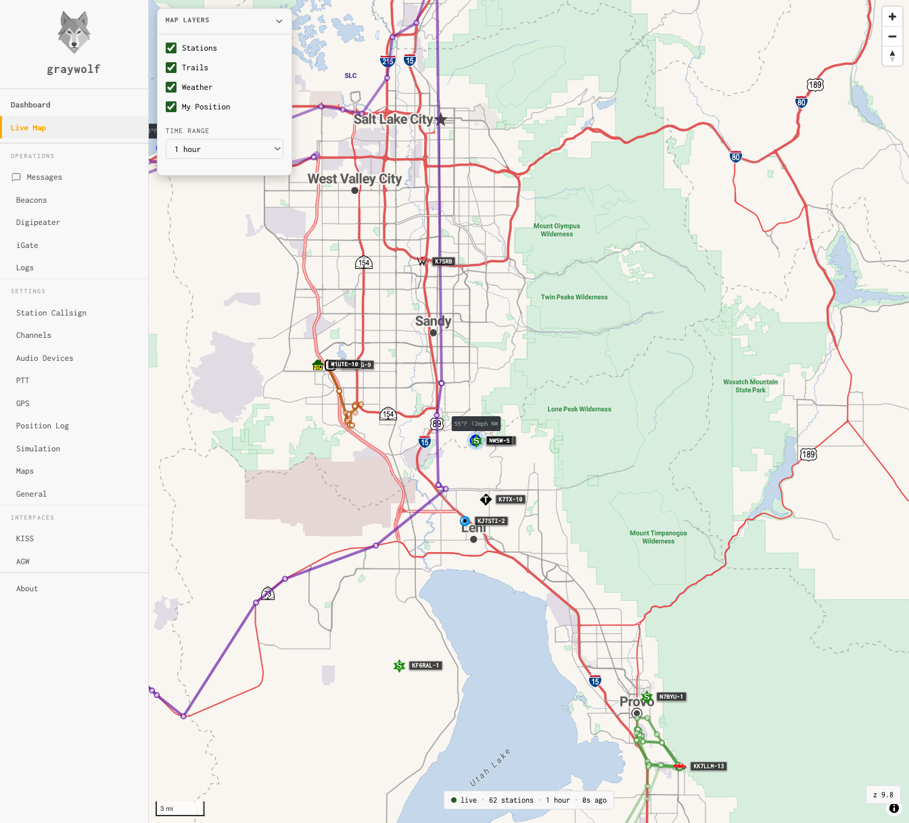

<div align="center">

# 🛜 OASIS

### Off-grid Amateur Station Information Suite

> ### *Comms when the network's gone dark.*

**A complete amateur-radio EmComm toolkit that runs with zero internet — on a Raspberry Pi, your laptop, or a USB stick.**

Forms · FCC lookup · offline maps · APRS · calculators · reference library — served to any browser on your local network.


</div>

---

## ⚡ At a glance

| | |
|---|---|
| **What it is** | A browser dashboard for emergency communications, served from a tiny local web server. |
| **Who it's for** | Hams running nets, ARES/RACES ops, field deployments, and grid-down preparedness. |
| **The promise** | No internet at runtime. No cloud account. No app to install on client devices. |
| **Runs on** | Raspberry Pi Zero 2 W (primary) · also Pi 3/4/5, macOS, Windows, Linux. |
| **Access it** | Any phone/tablet/laptop on the same Wi-Fi or hotspot → `http://<host-ip>:8083`. |
| **Install size** | ~2.3 MB of bundled Python wheels — the whole server installs offline. |

---

## 🚀 Quick start

```bash
# 1 — Get the code
git clone https://github.com/W4MHI/oasis-emcomm
cd oasis-emcomm

# 2 — Install the server (offline — all dependencies are vendored)
python3 scripts/setup-server.py

# 3 — Download FCC callsign data (one-time, needs internet — ~160 MB)
python3 scripts/setup-fcc-database.py --full-zip

# 4 — Launch
./start.sh                 # Linux / macOS   (Windows: double-click start.bat)
```

Then open **`http://localhost:8083`** — or `http://<host-ip>:8083` from any other device on the network.

> 💡 **Truly offline install.** Step 2 needs no internet — Flask, gunicorn, and psutil ship as pre-built wheels for every supported platform and Python 3.9–3.14. Only the one-time FCC data download (step 3) goes online, and you can do it on any machine and copy the result to the Pi.

---

## 🧰 Scripts — what to run, when & why

**Only `setup-server.py` is required to run OASIS.** Everything else is opt-in, per feature. Each script prints a progress/pre-flight summary so you always know what it's doing.

| Script | What it does | When to run it | Runs on | Internet? |
|---|---|---|---|:--:|
| **`setup-server.py`** | Creates `.venv` and installs Flask / gunicorn / psutil — auto picks PyPI or bundled wheels | **Once** after cloning; again if `requirements.txt` changes | Every host that runs OASIS | ❌ offline |
| `setup-fcc-database.py` | Downloads the FCC license data and builds the callsign lookup index | Once before first use; re-run weekly for fresh data (FCC updates Sundays) | Any online machine, then copy to the Pi | ✅ yes |
| `build-map.py` | Turns an OSM / BBBike extract into an offline `.pmtiles` map region | When you want a new or updated map area | Prep machine (needs GDAL + tippecanoe) | ✅ extract downloaded separately |
| `install-graywolf.py` | Installs the **GrayWolf** APRS service (TNC / iGate / digipeater) | On the Pi, to turn on APRS | Raspberry Pi / Debian Linux | ⚠️ optional — uses bundled `.deb` if present |
| `install-kiwix.py` | Installs the `kiwix-serve` offline-content server | On the Pi, to turn on offline Wikipedia | Raspberry Pi / Linux | ⚠️ optional — uses bundled package if present |
| `install-rtl-sdr.py` | Installs RTL-SDR tools + blacklists the conflicting DVB driver | On the Pi, to enable USB SDR dongles (RTL2832U) | Raspberry Pi / Debian Linux | ⚠️ optional — uses bundled `.deb` if present |
| `install-webssh.py` | Installs **ttyd** browser-based SSH terminal (login via `ssh@localhost`); `--dry-run` previews, `--verify` self-checks | On the Pi, to enable a web shell on port 7681 | Raspberry Pi / Debian Linux | ⚠️ optional — uses bundled static binary if present, else downloads |
| `download-wikipedia.py` | Downloads a Wikipedia ZIM snapshot for Kiwix | After `install-kiwix.py`, to get content | Pi (or prep + copy) | ✅ yes |
| `create-oasis-offline.py` | Runs incrementally: updates only missing/outdated packages (wheels, GrayWolf, Kiwix, RTL-SDR, webssh, FCC), then builds the USB bundle. Use `--rebuild` for a clean slate | Run anytime — updates only what changed, then produces oasis-offline/ | Any online host | ⚠️ Windows runtime only |

> 🔢 **Version-aware installs:** every `install-*` script compares versions before acting — it installs when a package is absent, **upgrades** when the bundled/available version is newer, and **keeps what you have** when it's the same or older (never downgrades). So re-running an installer, or installing from an older USB bundle, can't clobber a newer package already on the Pi.

> 📦 **Why the repo stays small:** the large data — map tiles, FCC database, PDF radio manuals, and Wikipedia — is **downloaded or generated by these scripts**, not stored in the repo. A fresh clone is just code; you build out exactly the data you need for your deployment.

---

## 💾 Portable USB bundle

```bash
python3 scripts/create-oasis-offline.py
```

Updates all offline packages (Python wheels · GrayWolf · Kiwix · RTL-SDR · webssh · FCC database), then produces a self-contained folder that runs with no system Python on Windows (bundled embedded Python) and bootstraps offline from the vendored wheels on Linux/macOS. Use `--skip-windows` for a 100% offline Linux/macOS build.

---

## ✨ Features

#### 📋 Emergency communications forms
ICS **205 · 213 · 214 · 309** — fill official FEMA PDF templates, import/export CSV, auto-save, and import frequencies straight from CHIRP.

#### 🔎 FCC callsign lookup
Offline binary search over a local copy of the FCC amateur database — name, city, state, Maidenhead grid, lat/lon in sub-millisecond time, with no database engine.

#### 🗺️ Offline maps
OpenStreetMap vector tiles via **MapLibre GL + PMTiles**, served from the host with HTTP range streaming. Multi-region, switchable layers, not a single tile fetched from the internet.

#### 📡 APRS (Raspberry Pi)
**GrayWolf** TNC / iGate / digipeater plus a live station map, packet logs, and tactical messaging. See [the APRS section](#-aprs-on-the-raspberry-pi) below.

#### 🧮 Tools & calculators *(browser-only)*
Antenna calculator · grid/distance/bearing · power & battery budget · gray-line propagation · solar & band conditions · net check-in logger with map and CSV export.

#### 📚 Reference library *(no setup)*
U.S. band plan · Q-codes, NATO phonetics, pro-words, RST, ITU prefixes · per-radio cheatsheets & operation cards · CHIRP programming guides · GrayWolf handbook. *(Add your own PDF radio manuals to `radio-manuals/` — they're not bundled.)*

#### 💾 Portable USB bundle
`scripts/create-oasis-offline.py` packages everything into a self-contained folder — Windows runs from a bundled Python (double-click `start.bat`), Linux/macOS bootstrap from the vendored wheels. [Details](#-portable-usb-bundle).

---

## 📡 APRS on the Raspberry Pi

APRS is the flagship Pi capability. OASIS installs and supervises **[GrayWolf](https://github.com/chrissnell/graywolf)** — a browser-based APRS TNC, iGate, and digipeater — and adds a companion API so the dashboard shows live stations on the offline map.

```bash
python3 scripts/install-graywolf.py     # Debian/Ubuntu/Raspberry Pi OS, picks the right .deb for your arch
```



GrayWolf runs on port **8080**; OASIS reads its history database and serves station positions to the dashboard map. Full configuration walkthrough (audio, PTT, beacons, SmartBeaconing, digipeater rules, iGate) is in **[docs/SETUP.md](docs/SETUP.md)**.

---

## 💻 Platform support

Every cell below is verified to install **fully offline** from the bundled wheels (`python3 scripts/create-oasis-offline.py --check`):

| Platform | Python 3.9 | 3.10 | 3.11 | 3.12 | 3.13 | 3.14 |
|---|:--:|:--:|:--:|:--:|:--:|:--:|
| **Raspberry Pi (64-bit / aarch64)** | ✅ | ✅ | ✅ | ✅ | ✅ | ✅ |
| Linux x86-64 | ✅ | ✅ | ✅ | ✅ | ✅ | ✅ |
| macOS (Apple Silicon) | ✅ | ✅ | ✅ | ✅ | ✅ | ✅ |
| macOS (Intel) | ✅ | ✅ | ✅ | — | — | — |
| Windows (amd64) | ✅ | ✅ | ✅ | ✅ | ✅ | ✅ |

Raspberry Pi OS **Bookworm** (Python 3.11) and **Bullseye** (3.9) both work out of the box. 32-bit Pi OS (armv7l/armhf) is not yet covered offline.

---

## 🧩 How it works

A single small **Flask** app serves the dashboard, the FCC lookup API, and the map tiles. Everything heavy (forms, calculators, reference) is static HTML that runs in the browser using `localStorage` — the server never writes browser state. Companion services (GrayWolf, Kiwix) run as their own processes; the dashboard discovers them at runtime, so nothing hardcodes a port.

| Port | Service |
|:--:|---|
| **8083** | OASIS — dashboard, FCC lookup, map tile server |
| 8085 | APRS history API (feeds the dashboard map) |
| 8080 | GrayWolf APRS *(optional, Pi)* |
| 8081 | Kiwix offline Wikipedia *(optional, Pi)* |
| 7681 | webssh / ttyd browser terminal *(optional, Pi)* |

**Design principles:** fully offline at runtime · no CDN links (all JS/CSS/fonts local) · minimal backend · `localStorage` only · zero client install.

---

## 🔐 Network & security

OASIS is built for a **trusted off-grid LAN or hotspot**. By design it binds to `0.0.0.0` (so other devices can reach it) and has **no authentication** — anyone on the same network can use it. That's the right model for a field net, but:

> ⚠️ **Do not expose OASIS directly to the public internet or an untrusted network.** Keep it on your own hotspot/LAN, or put it behind a firewall/VPN if remote access is needed.

---

## 🛠️ Hardware (reference build)

| Component | Spec |
|---|---|
| Board | Raspberry Pi Zero 2 W (also Pi 3/4/5, any Linux/macOS/Windows host) |
| RAM | 512 MB |
| Storage | 32 GB SD card minimum |
| OS | Raspberry Pi OS Lite 64-bit |
| Network | Local hotspot or LAN — no internet |

---

## 📖 Documentation

Full setup, data pipelines, and deployment guides live in **[docs/SETUP.md](docs/SETUP.md)**:
server + systemd auto-start · FCC database pipeline · building map PMTiles from OSM · GrayWolf APRS · Kiwix/Wikipedia · ICS PDF templates · USB bundle · keeping data fresh.

Maintainers: offline packages are kept current by running **`scripts/create-oasis-offline.py`** (incremental — updates wheels, GrayWolf, Kiwix, RTL-SDR, webssh, and FCC data; only downloads what changed; use `--rebuild` for a full clean refresh). CI (`server-setup` workflow) verifies `setup-server.py` across all supported platforms and Python versions on every push.

---

## 🙏 Credits

**OASIS** is designed and maintained by **W4MHI** (Pacific Northwest) for field deployment in Washington state.

It grew out of the **ACK Off-Grid Ham Radio Server** by **Jason, KM4ACK** (Tennessee) — the original concept of a fully offline, browser-accessible amateur-radio toolkit on a Raspberry Pi is his. [KM4ACK on GitHub](https://github.com/km4ack) · APRS by **[GrayWolf](https://github.com/chrissnell/graywolf)** (Chris Snell) · offline Wikipedia by **[Kiwix](https://kiwix.org/)**.

<div align="center">

**73 — comms when the network's gone dark.**

</div>
