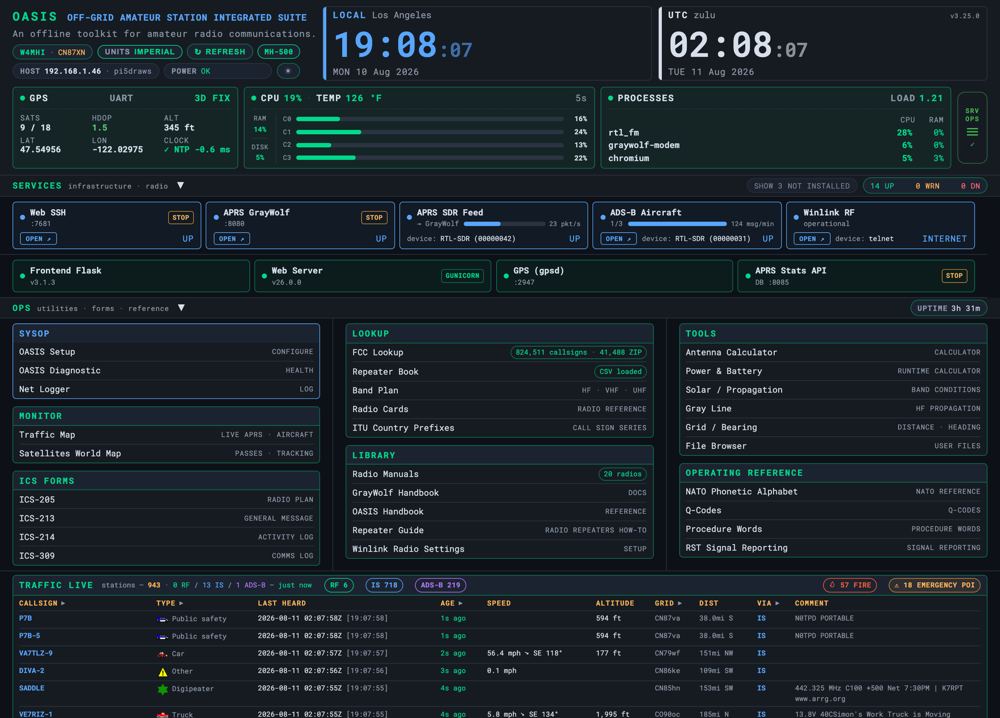
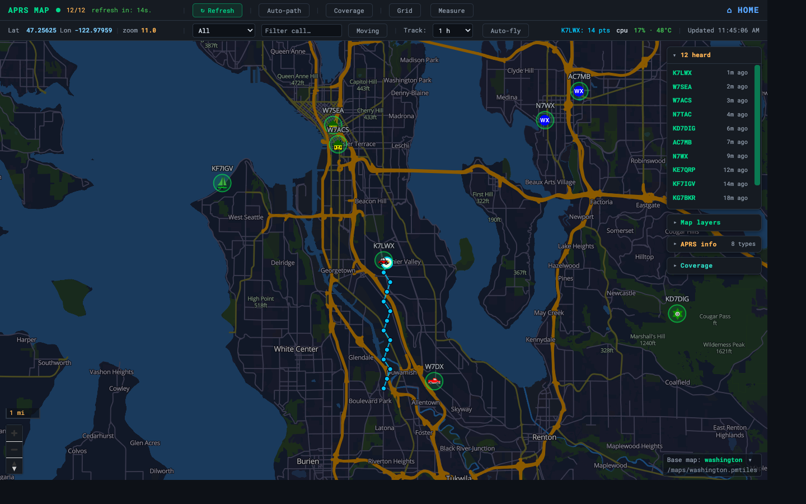
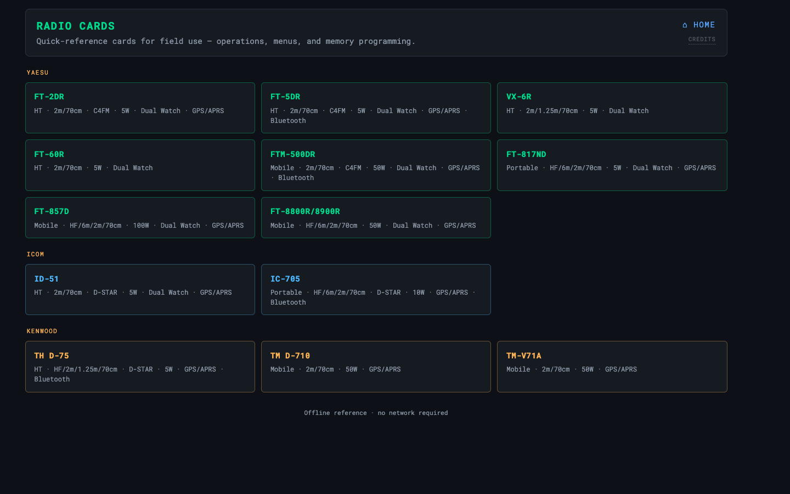
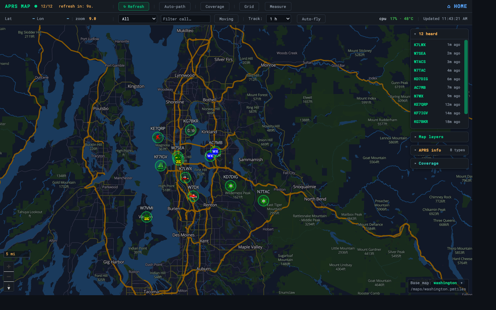

<div align="center">

# 🛜 OASIS

### Off-grid Amateur Station Integrated Suite

> ### *A complete amateur-radio station that just works — with or without the internet.*
>
> *Comms when the network's gone dark.*

**A complete, offline amateur-radio station you actually enjoy using — on a Raspberry Pi, your laptop, or a USB stick. Ready when the grid goes down.**

Forms · FCC lookup · offline maps · APRS · calculators · reference library — served to any browser on your local network.


[](https://github.com/W4MHI/oasis/actions/workflows/offline-install.yml)
[](https://github.com/W4MHI/oasis/actions/workflows/offline-manifest.yml)

</div>

<div align="center">
  
  <br><br>
  
  
  
</div>

---

## ⚡ At a glance

| | |
|---|---|
| **What it is** | A complete offline amateur-radio station in a browser dashboard, served from a tiny local web server. |
| **Who it's for** | Hams at the bench, in the field (POTA/SOTA), running nets — and ARES/RACES ops when the grid is down. |
| **The promise** | No internet at runtime. No cloud account. No app to install on client devices. |
| **Runs on** | Raspberry Pi 3/4/5 (primary) · also macOS, Windows, Linux. |
| **Access it** | Any phone/tablet/laptop on the same Wi-Fi or hotspot → `http://<host-ip>:8083`. |

📖 **Want the *why*?** Read **[concept.md](docs/concept.md)** — the vision, the problem it solves, and the design principles.

---

## ✨ Features

Each feature links to its full setup section. New here? Start with **[Quick start](#-quick-start)** below — the server alone gives you the dashboard, FCC lookup, maps, forms, calculators, and the reference library.

#### 🎙 Get on the air

- **📡 APRS** *(Pi)* — **GrayWolf** TNC / iGate / digipeater with a live station map (track history, auto-fly, sonar animations), APRS Stats API, and tactical messaging. Dashboard shows live station table with callsign, last-heard time, speed, altitude, and comment. → [Setup](docs/SETUP.md#graywolf-aprs)
- **📧 Winlink** *(Pi)* — Pat client + web UI for store-and-forward email over radio. **Internet gateway (Telnet) works now. RF radio path is experimental** — see [Winlink setup](docs/SETUP.md#winlink-pat) for current status. → [Setup](docs/SETUP.md#winlink-pat)
- **🌐 OpenWebRX** *(Pi)* — optional SDR receiver web UI for spectrum monitoring and multi-mode decoding. → [Setup](docs/SETUP.md#openwebrx-sigint)
- **📻 RTL-SDR** *(Pi, Trixie)* — demodulate 2 m APRS from a USB dongle and feed it into GrayWolf (receive / iGate). → [Setup](docs/SETUP.md#rtl-sdr)
- **📻 Repeater Book** — load a CHIRP-format CSV from RepeaterBook, browse with instant search/filters, and export the visible set as a ready-to-import frequency plan. → [Setup](docs/SETUP.md#repeater-book)

#### 🗺 See around you

- **✈️ ADS-B aircraft** *(Pi)* — decode 1090 MHz aircraft locally with `dump1090-fa` and plot them live on the *same* offline map as APRS: altitude-coloured icons, airline decode from the flight callsign, and a 24 h history drawer. Emergency-squawk (7500 / 7600 / 7700) and station-proximity alerts. Shares the RTL-SDR dongle, so starting it stops the APRS feed / OpenWebRX. → [Setup](docs/SETUP.md#adsb-aircraft)
- **🛰️ Satellite tracking** *(Pi)* — an offline pass predictor for the ham and weather birds. A roster aggregated from **SatNOGS** (downlink freqs + modes) and **CelesTrak** (TLEs); next-pass times, peak elevation, and a live sky/footprint view via **Skyfield/SGP4** — all computed on the Pi, no internet at runtime. The roster is **baked into the offline bundle** at build time, so a fresh Pi predicts passes out of the box. **Monitored·1h / All·1h** views, a **Filters** menu (capability · band · **orbit class** LEO/MEO/GEO/HEO), Morse-"V" + spoken pass alerts, and **live SDR audio**: arm a downlink and Listen or Record it through the pass (FM/APRS · CW · SSB) straight in the browser. → [Setup](docs/SETUP.md#satellites)
- **🛰️ GPS / GNSS & time sync** *(Pi)* — GPS-disciplined clock (`gpsd` + `chrony`) for accurate FT8/WSPR/SSTV timing with no internet, plus a live GPS card in the dashboard header: fix mode (3D/2D/no-fix), satellites, HDOP (colour-coded), altitude, lat/lon, and chrony clock-lock status. → [Setup](docs/SETUP.md#gps-time-sync-gpsd--chrony)
- **🗺️ Offline maps** — OpenStreetMap vector tiles via MapLibre GL + PMTiles, streamed from the host with HTTP range reads. Multi-region, switchable layers, not a single tile from the internet. Load maps at runtime straight off a USB stick or the GrayWolf tiles directory — no copying into the repo. → [Setup](docs/SETUP.md#offline-maps)

#### 📚 Know your stuff

- **🔎 FCC callsign lookup** — sub-millisecond binary search over a local copy of the FCC amateur database. Search by **callsign** (exact or prefix wildcard), **name** (last name + optional first name), or **Maidenhead grid** (2–6 char prefix). Returns callsign, name, city, state, grid, lat/lon. No database engine; three sorted flat-file indexes. → [Setup](docs/SETUP.md#fcc-callsign-lookup)
- **📚 Reference library** — U.S. band plan, Q-codes, phonetics, procedure words (including ICS plain-language substitution table), RST, ITU prefixes, per-radio cheat-sheets, CHIRP guides, GrayWolf handbook. Drop your own PDFs into `static/radio-manuals/`. → [Setup](docs/SETUP.md#reference-library)
- **📖 Offline Wikipedia** *(Pi)* — Kiwix serving a ZIM snapshot. → [Setup](docs/SETUP.md#kiwix--wikipedia)

#### 🧮 Run the numbers

- **🧮 Tools & calculators** — antenna, grid/distance/bearing, power & battery budget, gray-line propagation, band conditions, and a net check-in logger with CSV export. → [Setup](docs/SETUP.md#tools--calculators)
- **📐 Units toggle** — switch all measured values (temperature, altitude, speed) between imperial and metric from a single pill button; preference persisted per browser. → [Setup](docs/SETUP.md#tools--calculators)

#### 🆘 Ready for the worst

- **📋 Emergency forms** — ICS **205 · 213 · 214 · 309** on official FEMA PDF templates. Import/export CSV, auto-save, import frequencies from CHIRP. → [Setup](docs/SETUP.md#ics-forms)

#### 🔧 Under the hood

- **⚙️ System monitor** — a header row of live cards, polled every 5 s: **local + UTC clocks**, a **CPU card** (usage, SoC temp, RAM, disk, plus per-core usage bars), a **PROCESSES card** (top 3 by CPU, 1-min load average), and a **STATUS card** (uptime, Pi power/throttle state, host/LAN IP, and the HW radio-assignment dots below). Everything is colour-coded green/amber/red by threshold. Deeper diagnostics (ALSA audio devices, per-platform health checks) live on the Setup/health-check page. → [Setup](docs/SETUP.md#server-setup)
- **📶 Wi-Fi status pill** — one glance at how the Pi is reaching the network: `OASIS` in blue when hosting the AP fallback, the connected SSID coloured green/amber/red by signal strength when on a client network, dim when disconnected. Shared between the dashboard and the touch kiosk. → [Setup](docs/SETUP.md#using-oasis-in-the-field-no-internet)
- **🔧 Service controls** — start/stop controllable services (GrayWolf, Winlink, Kiwix, Web SSH, OpenWebRX) directly from the dashboard service strip without SSH. → [Setup](docs/SETUP.md#service-controls-dashboard-power-buttons)
- **🎛️ Service Operations console** — a device→service assignment matrix (the "mixer board") on both the dashboard and the touch kiosk: one-tap reroute an SDR or sound-card between APRS, ADS-B, OpenWebRX, satellites, and Winlink, per-device **lock** to protect an assignment, and a one-click **STOP ALL**. An opt-in **resource guardian** runs as a background thread on the server — independent of any browser tab — and watches temperature/CPU/memory; if one crosses its threshold (80 °C / 95 % / 92 % by default, operator-tunable) it arms a 30-second cancellable countdown, shown as a banner on whatever's open, then auto-runs STOP ALL if nobody cancels. **Web SSH is always left running** so a tripped guardian can never lock you out of the box. → [API](docs/api.md#hardware-allocation-apihardware)
- **💻 Web SSH terminal** *(Pi)* — a browser login shell (ttyd) on the Pi — no SSH client needed. → [Setup](docs/SETUP.md#webssh--browser-terminal)
- **🕐 Hardware RTC** *(Pi)* — optional Witty Pi 3 (DS3231) battery-backed clock that keeps time across reboots and power loss. → [Setup](docs/SETUP.md#hardware-rtc-witty-pi-3)
- **🖥️ Panel & cooling add-ons** *(Pi)* — on-device CM4Stack panel display, RGB Cooling HAT fan/OLED, and the OASIS Dashboard touch kiosk (800×480 / 1920×1200). → [Setup](docs/SETUP.md#cm4stack-panel-display)
- **💾 Portable USB bundle** — package the whole suite into a self-contained folder that runs with no system Python on Windows (`--for-windows`), or Pi/Linux only (default). → [Setup](docs/SETUP.md#usb--portable-bundle)

---

## 🚀 Quick start

OASIS is **offline-first**, so the recommended path is to build a self-contained bundle **on your everyday computer** (macOS / Windows / Linux) and carry it to the Raspberry Pi on a USB stick. The Pi never needs internet.

### 1 · Clone on your computer

```bash
git clone https://github.com/W4MHI/oasis
cd oasis
```

### 2 · Build the offline USB bundle

```bash
python3 scripts/create-oasis-offline.py        # add --for-windows to also bundle the Windows runtime
```

This downloads every offline asset (Python wheels · GrayWolf · Kiwix · RTL-SDR · webssh · Pat · FCC database · map tools) and assembles a self-contained **`oasis-offline/`** folder in the repo root. Copy that whole folder onto a USB drive.

### 3 · Keep the bundle current

Re-run the same command anytime — it's **incremental**, so it only fetches what changed. To refresh an existing copy in place (for example the one already on your USB), use `--update`:

```bash
python3 scripts/create-oasis-offline.py --update                 # update ./oasis-offline in the oasis folder
python3 scripts/create-oasis-offline.py --update --dir /mnt/usb  # or update the USB drive directly
```

### 4 · Copy the bundle to the Raspberry Pi

Plug the USB into the Pi and copy the bundle into your home directory (e.g. `~/oasis`).

> 🚫 **Don't `git clone` directly on the Pi for a full deployment.** A clone gives you code only — you'd still need internet on the Pi to pull GrayWolf, Kiwix, the FCC database, and the rest. And once the offline assets are generated, the working folder grows large (wheels, `.deb`s, tiles, ZIMs). Build the bundle on your computer and carry it over. *(A bare clone on the Pi is fine only if you want just the server + dashboard and nothing that needs downloads.)*

> ⚠️ **Fresh Pi?** Flash the SD card, enable SSH, and install `git` first — see **[Before you begin](docs/SETUP.md#before-you-begin-raspberry-pi)**. `git` isn't pre-installed on Raspberry Pi OS Lite.

### 5 · Run the guided setup

On the Pi, run the menu **as your normal user — not with sudo**:

```bash
cd ~/oasis
python3 setup-oasis.py          # guided checkbox menu
```

**Reboot when it finishes** so all settings and services come up cleanly:

```bash
sudo reboot
```

After the Pi is back online:

- If you ticked **Auto-start on boot**, OASIS is already running — just open `http://<pi-ip>:8083`.
- Otherwise, start it manually, then open `http://<pi-ip>:8083`:

  ```bash
  cd ~/oasis
  scripts/start-server.sh
  ```

> 💡 **Truly offline.** Flask, gunicorn, and psutil ship as pre-built wheels for every supported platform and Python 3.9–3.14. Only the one-time data downloads (FCC, maps, Wikipedia) touch the internet — do them on any machine and carry the result over.

---

## 🧭 The setup menu — what to tick

On a Pi, **`setup-oasis.py` is the front door** — it delegates to the individual scripts below, so each stays the single source of truth. The only hard requirement underneath is `setup-server.py`; everything else is opt-in, per feature.

> 🔢 **Version-aware, suite-aware & idempotent:** every `install-*` script installs when absent, **upgrades** when newer, and **keeps what you have** otherwise — never downgrades. It also picks the **newest source** (apt vs the bundle) and the packages for **your OS version** (bookworm/trixie), so a bundle built for an older OS can't install a stale, broken driver on a newer one. Re-running setup, or installing from an older USB bundle, can't clobber a newer package.

> 📦 **Why the repo stays small:** the large data (map tiles, FCC database, PDF manuals, Wikipedia) is downloaded or generated by these scripts, not stored in the repo. A fresh clone is just code.

<details>
<summary><b>Full script reference</b> — what to run, when & why</summary>
`setup-oasis.py` is a grouped checkbox menu. Tick what you want; it runs the matching install/enable scripts **in order**, pulls in prerequisites, and asks for your password just once. The **pre-checked** items give you a working field station out of the box — dashboard, APRS, web terminal, service controls, and Wi-Fi fallback. Everything else is opt-in. Re-run the menu anytime to add features.

**Server**

| Menu item | Default | What it gives you |
|---|:--:|---|
| Server (.venv + deps) | ✅ | The Flask web server — dashboard, FCC lookup, map tiles. Foundation for everything. |
| Auto-start on boot | ✅ | systemd unit so OASIS starts at boot (skip the launcher). |
| GrayWolf APRS (+ history API) | ✅ | APRS TNC/iGate/digipeater on :8080 + history API on :8085. |
| Winlink (Pat) | ⬜ | Pat Winlink client + web UI on :8082 (Telnet works now; RF experimental). |
| Winlink RF via DigiRig | ⬜ | Point the Winlink Direwolf modem at a DigiRig Mobile (USB audio + CP210x serial RTS PTT) instead of the DRA-Pi. |
| Kiwix (offline content) | ⬜ | `kiwix-serve` on :8081 for ZIM content (add Wikipedia below). |
| Web SSH (ttyd) | ✅ | Browser terminal on :7681. |
| OpenWebRX (SDR monitor) | ⬜ | RX-only SDR web UI on :8073 — experimental, off by default. |
| Dashboard service controls | ✅ | Scoped sudoers rule so the dashboard start/stop buttons work. |
| Wi-Fi AP fallback | ✅ | Pi hosts the `OASIS` hotspot when no known network is in range. |

**Display** *(Raspberry Pi OS with Desktop)*

| Menu item | Default | What it gives you |
|---|:--:|---|
| Kiosk mode (Chromium fullscreen) | ⬜ | Auto-start + fullscreen Chromium kiosk of the desktop dashboard. |
| Kiosk mode — OASIS Dashboard, 7″ (800×480) | ⬜ | Fullscreen kiosk of the touch-first OASIS Dashboard on a 7″ panel. |
| Kiosk mode — OASIS Dashboard, 10″ wide (1920×1200) | ⬜ | The same OASIS Dashboard kiosk, tuned for a 10″ 1920×1200 panel. |
| Desktop launcher icon | ⬜ | Clickable OASIS desktop shortcut. |

**Audio** *(audio paths into GrayWolf)*

| Menu item | Default | What it gives you |
|---|:--:|---|
| RTL-SDR tools | ⬜ | `rtl_test`/`rtl_fm` + socat/tcpdump; blacklists the DVB driver. **Pi OS Trixie for the V4.** |
| RTL-SDR → GrayWolf APRS feed | ⬜ | Streams demodulated 2 m APRS into GrayWolf over `sdr_udp`. |
| ADS-B Aircraft | ⬜ | 1090 MHz aircraft on the offline map (`dump1090-fa` + recorder on :8086); shares the SDR dongle. Off by default. |
| DRA-Pi-Zero sound card | ⬜ | Configures the WM8731 codec for GrayWolf — **reboot required**. |
| DRA-Pi green RX LED | ⬜ | Pulses the RX LED on decoded packets. |

**GPS / Time · RTC**

| Menu item | Default | What it gives you |
|---|:--:|---|
| GPS time (gpsd + chrony) | ⬜ | GPS-disciplined clock for FT8/WSPR/SSTV timing with no internet. |
| Witty Pi 3 RTC (DS3231) | ⬜ | Battery-backed hardware clock — **reboot required**. |
| BigTreeTech 7″ RTC (PCF8563) | ⬜ | The 7″ touchscreen's onboard clock (DSI `i2c_csi_dsi` bus) — **reboot required**. |

**Content / Data** *(large downloads / dashboard toggles)*

| Menu item | Default | What it gives you |
|---|:--:|---|
| FCC callsign database | ✅ | Downloads + indexes the FCC amateur DB (~160 MB). |
| Satellite list (SatNOGS + CelesTrak) | ✅ | Builds the satellite roster + TLEs so offline pass prediction works (~5 MB). Refresh every few days. |
| Satellite pass-alert voice | ✅ | Spoken pass alerts (speech-dispatcher + espeak-ng, ~5 MB apt); alerts still chime without it. |
| Wikipedia content (ZIM) | ⬜ | Downloads a Wikipedia ZIM for Kiwix (1 GB → ~100 GB). |
| Repeater Book listing | ✅ | Shows the dashboard link — drop your own `repeaterbook.csv` in. |
| ICS Forms section | ✅ | Toggles the ICS-205/213/214/309 dashboard section. |

✅ = pre-checked · ⬜ = opt-in

---

## 🧩 How it works

A single small **Flask** app serves the dashboard, the FCC lookup API, and the map tiles. Everything heavy (forms, calculators, reference) is static HTML running in the browser via `localStorage` — the server never holds browser state. Companion services run as their own processes and the dashboard discovers them at runtime, so a missing service just greys out a card.

| Port | Service |
|:--:|---|
| **8083** | OASIS — dashboard, FCC lookup, map tile server, ICS/tools, **Satellites** page + pass API + live SDR audio |
| 8085 | APRS history API (feeds the dashboard map) |
| 8086 | ADS-B recorder + history API *(optional, Pi)* |
| 8080 | GrayWolf APRS *(optional, Pi)* |
| 8082 | Pat Winlink web UI *(optional, Pi)* |
| 8081 | Kiwix offline Wikipedia *(optional, Pi)* |
| 7681 | webssh / ttyd browser terminal *(optional, Pi)* |

**Design principles:** offline at runtime · no CDN links (all JS/CSS/fonts local) · minimal backend · `localStorage` only · zero client install. More in **[concept.md](docs/concept.md)**.

---

## 🧰 Setup scripts

| Script | What it does | When | Runs on | Internet? |
|---|---|---|---|:--:|
| **`setup-oasis.py`** | Guided menu installer — pick features, delegates to the install/enable scripts in order; primes `sudo` once | Set up a Pi; re-run to add features | Raspberry Pi / Linux (as your user, **not** sudo) | ⚠️ bundled if present |
| **`setup-server.py`** | Creates `.venv` and installs Flask / gunicorn / psutil | Once after cloning; again if `requirements.txt` changes | Every host that runs OASIS | ❌ offline |
| `services/fcc_database/install.py` | Downloads FCC license data and builds the callsign index | Once before first use; weekly for fresh data (FCC updates Sundays) | Any online machine, then copy to the Pi | ✅ yes |
| `services/graywolf/install.py` | Installs **GrayWolf** APRS (TNC/iGate/digipeater); also calls `enable-graywolf-api.py` automatically | On the Pi, to turn on APRS | Raspberry Pi / Debian | ⚠️ bundled `.deb` if present |
| `services/graywolf/enable-graywolf-api.py` | Installs and enables the GrayWolf APRS history API service (port 8085); run manually to re-enable after moving the repo | After GrayWolf install | Raspberry Pi / Linux (systemd) | ❌ offline |
| `services/winlink/install.py` | Installs **Pat** Winlink client + web UI (:8082), writes a starter config, and sets up a Direwolf RF modem (`--modem-interface dra`\|`digirig`) | On the Pi, for Winlink email | Raspberry Pi / Debian | ⚠️ bundled `.deb` if present |
| `services/kiwix/install.py` | Installs `kiwix-serve` offline-content server | On the Pi, for offline Wikipedia | Raspberry Pi / Linux | ⚠️ bundled if present |
| `features/rtl-sdr/install-rtl-sdr.py` | Installs RTL-SDR tools (+ socat/tcpdump + multimon-ng), blacklists the DVB driver | On the Pi, for USB SDR dongles | Pi OS **Trixie** (V4 needs librtlsdr ≥ 2.0) | ⚠️ bundled `.deb` if present |
| `features/rtl-sdr/enable-rtl-sdr.py` | Tests the dongle, streams demodulated APRS audio into GrayWolf | After `features/rtl-sdr/install-rtl-sdr.py`, dongle plugged in | Pi OS **Trixie** | ❌ offline |
| `services/openwebrx/install.py` | Installs **OpenWebRX+** receive-only SDR web UI on :8073 (off by default) | On the Pi, for spectrum monitoring | Pi OS bookworm/trixie | ✅ yes (3rd-party repo) |
| `services/adsb/install.py` | Installs **`dump1090-fa`** (1090 MHz ADS-B decoder) + the OASIS recorder/history API on :8086 (off by default) | On the Pi, for aircraft tracking | Pi OS bookworm/trixie | ⚠️ bundled `.deb` if present, else online |
| `services/satellites/build-roster.py` | Aggregates the satellite list from **SatNOGS** (freqs/modes) + **CelesTrak** (TLEs) into `configuration/satellites.json` | On any online machine; re-run every few days as TLEs age | Any host | ✅ yes |
| `services/satellites/install-predict.py` | Installs the **Skyfield** + numpy pass-prediction stack into the server venv (required for passes/track) | When enabling Satellites | Any host running OASIS | ⚠️ bundled wheels if present, else online |
| `services/satellites/install-voice.py` | Installs the TTS stack (speech-dispatcher + espeak-ng) for spoken pass alerts | Optional, with Satellites | Raspberry Pi / Debian | ⚠️ apt step online |
| `features/gps/install-gps.py` | Sets up GPS-disciplined time (`gpsd` + `chrony`) for offline FT8/WSPR/SSTV timing | On the Pi, with a USB GPS | Raspberry Pi / Debian | ⚠️ apt step online |
| `enable-rtc.py` | Configures a hardware RTC — Witty Pi 3 DS3231 (default) or `--board bigtreetech-7in` PCF8563 on the DSI bus — **reboot required** | On a Pi with the RTC | Raspberry Pi | ❌ offline |
| `enable-dra-pi.py` | Configures the DRA-Pi-Zero (WM8731) sound card for GrayWolf — **reboot required** | On a Pi with the DRA-Pi-Zero HAT | Raspberry Pi | ❌ offline |
| `services/webssh/install.py` | Installs **ttyd** browser SSH terminal on :7681 | On the Pi, for a web shell | Raspberry Pi / Debian | ⚠️ bundled binary if present, else downloads |
| `enable-service-controls.py` | Grants a narrow sudoers rule so the dashboard can start/stop services | To enable dashboard power buttons | Raspberry Pi / Linux (systemd) | ❌ offline |
| `install-rgb-cooling-hat.py` | Installs the Yahboom RGB Cooling HAT fan/OLED daemon | On a Pi with the HAT | Raspberry Pi | ⚠️ apt deps |
| `install-cm4stack.py` | Configures the M5Stack CM4Stack panel display — **reboot required** | On a CM4Stack | Raspberry Pi (CM4) | ❌ offline |
| `enable-autostart-pi.py` | Installs a **systemd service** so OASIS starts on boot; `--with-browser` adds a Chromium kiosk; `--desktop-icon` adds a clickable desktop shortcut; `--disable` removes all | After first successful manual run | Raspberry Pi OS (systemd) | ❌ offline |
| `services/kiwix/download-wikipedia.py` | Downloads a Wikipedia ZIM snapshot for Kiwix | After `services/kiwix/install.py` | Pi (or prep + copy) | ✅ yes |
| `create-oasis-offline.py` | Incrementally updates offline packages **and builds the satellite roster** (runs `build-roster` at build time, so a fresh Pi ships working pass prediction), then assembles the USB bundle. `--rebuild` for a clean slate | Anytime; produces `oasis-offline/` | Any online host | ✅ yes |
| `enable-ap-fallback.py` | Installs a Wi-Fi AP fallback so the Pi hosts the `OASIS` hotspot when no known network is in range — includes the `oasis-netwatch` watcher service and `oasis-netctl` helper | On the Pi, for field / no-router deployments | Raspberry Pi OS (NetworkManager) | ❌ offline |
| `enable-dra-rx-led.py` | Installs a daemon that pulses the DRA-Pi-Zero green RX LED (GPIO 16) on each decoded APRS packet — GrayWolf drives TX/PTT, this covers RX | After `enable-dra-pi.py`, reboot, and GrayWolf running | Raspberry Pi with DRA-Pi-Zero HAT | ❌ offline |
| `doctor.py` | Headless health check — mirrors every check in the browser setup page; reports server, FCC index, maps, disk, and optional services; exits 0 if all core checks pass | Post-deploy or SSH verification | Any host running OASIS | ❌ offline |
| `remove-oasis.py` | Dry-run, check, or apply a full teardown: stops/disables all OASIS services, removes managed system files, strips OASIS blocks from `config.txt` — never deletes downloaded data | When uninstalling or resetting to a clean state | Raspberry Pi / Linux | ❌ offline |

</details>

### 💾 Portable USB bundle

Building and updating the bundle is covered in **[Quick start](#-quick-start)** (steps 2–3). In short: `create-oasis-offline.py` updates all offline packages (wheels · GrayWolf · Kiwix · RTL-SDR · webssh · Pat · FCC database · map tools) and produces the self-contained `oasis-offline/` folder. Default builds target Linux/macOS (Pi); add `--for-windows` to also bundle the embedded Python runtime that `scripts/start-server.bat` needs on Windows.

---

## 📻 Repeater Book

Browse repeater listings offline at `static/repeaterbook/repeaterbook.html`. There's no bundled data — RepeaterBook listings are **not redistributable**, so you download your own.

1. At **[repeaterbook.com](https://www.repeaterbook.com)**, sign in (free) and search your region.
2. Export → **CHIRP** format.
3. Save as **`static/repeaterbook/repeaterbook.csv`** (next to `repeaterbook.html`).

> ⚠️ **Do not redistribute the CSV** — no public repos, shared USB bundles, or any other form. It's gitignored for this reason.

<details>
<summary>Viewer features</summary>

<br>

| Feature | Details |
|---|---|
| **Search** | Filter by name, frequency, callsign, city, or comment text — live as you type |
| **Mode filter** | FM · DMR · YSF/C4FM · P25 · D-STAR · NXDN · M17 |
| **Status filter** | Open / Closed |
| **Sortable columns** | Click any header to sort |
| **EMCOMM badge** | Auto-flags repeaters mentioning ARES, RACES, SKYWARN, etc. |
| **Export to Frequency Plan** | Saves the visible repeaters as CHIRP CSV to `chirp/<datetime>_repeaters.csv` — ready for ICS-205 or CHIRP |
| **Print** | Browser print dialog for a paper copy |
| **Service card** | Dashboard shows green when CSV is present, red when missing |

</details>

---

## 📡 APRS on the Raspberry Pi

APRS is the flagship Pi capability. OASIS installs and supervises **[GrayWolf](https://github.com/chrissnell/graywolf)** — a browser-based APRS TNC, iGate, and digipeater — plus a companion history API so the dashboard plots live stations on the offline map. Both are **pre-checked** in the setup menu.



GrayWolf runs its own web UI on port **8080**; OASIS reads its history database and shows the stations on the dashboard and at `/server/map/map.html`.

### Feeding APRS from an RTL-SDR dongle

To receive 2 m APRS from an **RTL-SDR dongle**, tick **RTL-SDR tools** and **RTL-SDR → GrayWolf APRS feed** in the setup menu (or run the scripts directly):

```bash
python3 features/rtl-sdr/install-rtl-sdr.py      # RTL-SDR driver + tools
python3 features/rtl-sdr/enable-rtl-sdr.py       # test the dongle, start the audio feed
```

This demodulates APRS and streams the audio to **`127.0.0.1:7355`** over UDP. GrayWolf isn't wired to it yet — finish in the **GrayWolf web UI** (`:8080`):

1. **Station** — set your **callsign** to enable the station identity.
2. **Position log** — **enable the database** so heard stations are recorded. This is the table the dashboard and APRS API read.
3. **Audio Devices → + Add Device** — create the SDR input *(don't click **Detect Devices** — it auto-adds a soundcard that hijacks the channel):*
   - **source type** `sdr_udp` · **path** `127.0.0.1:7355` · **sample rate** `48000` · **channels** Mono · **format** s16le · **direction** input
4. **Channels → add an AFSK / RX channel** — 1200 bps, 1200 / 2200 Hz, **RX input = the sdr_udp device** (not a soundcard).
5. **Restart GrayWolf** so it loads the new device + channel:
   ```bash
   sudo systemctl restart graywolf
   ```

> ⚠️ **The restart matters.** GrayWolf reads channel config only when the modem **starts** — a device/channel you add at runtime isn't live until a restart, and it can keep reporting `state=RUNNING` on the old config while nothing decodes. *(The classic "I set it up, nothing worked, I restarted, and it just worked.")*

Once it's running, the **APRS LIVE** table on the dashboard fills in and keeps updating, and three service cards go **green**: **APRS GrayWolf**, **APRS Stats API**, and **APRS SDR Feed**. If the feed card shows **SILENT**, audio is reaching the feed but nothing is decoding — check the dongle/antenna and frequency. Full walkthrough and debugging: **[docs/graywolf-rtl-sdr.md](docs/graywolf-rtl-sdr.md)**.

> ⚠️ **RTL-SDR needs Raspberry Pi OS Trixie (Debian 13).** The RTL-SDR Blog **V4** needs **`librtlsdr` ≥ 2.0**, which only Trixie ships (`2.0.2`). Bookworm/Bullseye top out at `0.6.0` and can't drive the V4. *(APRS via the DRA-Pi-Zero sound card has no such requirement.)*

<details>
<summary>Live map features (<code>/server/map/map.html</code>)</summary>

<br>

Refreshes every 15 seconds and includes:

- **Station markers** — APRS symbol icons with callsign labels; click for last-heard time, speed, course, altitude, and path.
- **Historical track** — **⟳ Show track** draws a station's position history; the time window (1 h → all) is selectable and re-fetches each cycle.
- **✈ Auto-fly** — flies to the tracked station's latest position on each refresh.
- **Recent-heard panel** — newly heard/updated stations, newest-first; click a callsign to fly there. New markers get an amber sonar-ping animation that settles into a dim halo.
- **Focus via URL** — clicking a callsign in the dashboard table opens the map at `?focus=CALLSIGN` and loads its track.

</details>

---

## 🔐 Security

OASIS is built for a **trusted off-grid LAN or hotspot**. It binds to `0.0.0.0` (so other devices can reach it) and has **no authentication** — anyone on the same network can use it. That's right for a field net, but:

> ⚠️ **Don't expose OASIS to the public internet or an untrusted network.** Keep it on your own hotspot/LAN, or behind a firewall/VPN for remote access.

---

## 💻 Platform support & hardware

Reference build: **Raspberry Pi 3/4/5**, 32 GB SD card, Raspberry Pi OS Lite 64-bit, on a local hotspot/LAN — no internet. Also runs on any Linux/macOS/Windows host.

<details>
<summary>Offline-install matrix (verified with <code>create-oasis-offline.py --check</code>)</summary>

<br>

| Platform | Python 3.9 | 3.10 | 3.11 | 3.12 | 3.13 | 3.14 |
|---|:--:|:--:|:--:|:--:|:--:|:--:|
| **Raspberry Pi (64-bit / aarch64)** | ✅ | ✅ | ✅ | ✅ | ✅ | ✅ |
| Linux x86-64 | ✅ | ✅ | ✅ | ✅ | ✅ | ✅ |
| macOS (Apple Silicon) | ✅ | ✅ | ✅ | ✅ | ✅ | ✅ |
| macOS (Intel) | ✅ | ✅ | ✅ | — | — | — |
| Windows (amd64) | ✅ | ✅ | ✅ | ✅ | ✅ | ✅ |

The server and everything else run on Raspberry Pi OS **Bookworm** (3.11) and **Bullseye** (3.9) too. 32-bit Pi OS (armv7l/armhf) is not yet covered offline.

**Exception — RTL-SDR APRS requires Raspberry Pi OS Trixie (Debian 13):** the RTL-SDR Blog V4 needs `librtlsdr ≥ 2.0`, which only Trixie ships. Bookworm/Bullseye top out at `0.6.0` and can't drive the V4. (APRS via the DRA-Pi-Zero sound card has no such requirement.)

</details>

---

## 📖 Documentation

- **[docs/concept.md](docs/concept.md)** — what OASIS is, the vision, and design principles. *Start here for the why.*
- **[docs/SETUP.md](docs/SETUP.md)** — full setup, data pipelines, and deployment for **every** feature: server + systemd auto-start · AP fallback · FCC database · map PMTiles · GrayWolf APRS · ADS-B aircraft · satellites · Winlink · RTL-SDR · OpenWebRX · GPS time sync & hardware RTC · web SSH · service controls · ICS forms · tools & calculators · reference library · Repeater Book · CM4Stack panel · RGB Cooling HAT · USB bundle · health check · keeping data fresh.
- **[docs/graywolf-dra-pi.md](docs/graywolf-dra-pi.md)** · **[docs/graywolf-rtl-sdr.md](docs/graywolf-rtl-sdr.md)** · **[docs/rtc-witty-pi.md](docs/rtc-witty-pi.md)** — hardware deep-dives: the DRA-Pi-Zero sound card, RTL-SDR APRS receive, and the Witty Pi 3 / DS3231 hardware clock.

> 🛠️ **Maintainers:** keep offline packages current with `scripts/create-oasis-offline.py` (incremental — only downloads what changed; `--rebuild` for a full refresh). CI (`server-setup`) verifies `setup-server.py` across all platforms and Python versions on every push.

---

## 📄 License

OASIS is released under the **[MIT License](LICENSE)** © 2026 W4MHI — free to use, modify, and distribute.

> ℹ️ **Third-party data and services keep their own licenses/terms.** OpenStreetMap map data is **ODbL**; **RepeaterBook** CSV exports are **not redistributable** (download your own); satellite transmitter data from **SatNOGS** (CC BY-SA) and **CelesTrak** TLEs are fetched at build time and go stale in days; radio manuals are copyright their manufacturers; and the companion services (GrayWolf, Pat, Kiwix, ttyd, OpenWebRX, dump1090-fa) ship under their respective upstream licenses.

---

## 🤖 How OASIS Is Built

OASIS is a two-person team: **W4MHI** (design calls, radio-domain judgment, the Pi that everything ships to) and **Claude** (Anthropic's Claude Code) as the day-to-day build partner.

- **Every change is human-reviewed before it ships.** Claude writes and edits code; W4MHI decides what ships, tests it against real hardware (GrayWolf, RTL-SDR dongles, DRA-Pi, satellite passes), and is the one who signs off. Nothing merges to `main` unverified.
- **Plan first, then build.** Non-trivial changes get a written plan and a confirm step before code moves — same discipline the [design principles](docs/concept.md#design-principles) apply to the product itself.
- **The same gates apply to every change, AI-authored or not.** `scripts/run-tests.sh` for the unit suite, a preflight pass (manifest validation, byte-compile, lint) mirroring CI, and `doctor.py` for a live health check — all before anything is called done.
- **Offline-first constrains the AI too.** No dependency, library, or pattern gets suggested if it assumes a network connection, a CDN, or a database engine — the [prime directive](docs/concept.md) governs Claude's suggestions exactly like a human contributor's.
- **Small scope, real hardware.** This isn't a multi-contributor project with bots triaging issues — it's one maintainer and one AI teammate iterating directly against a Raspberry Pi Zero 2 W, a stack of SDR dongles, and an actual radio bench.

Commits carry a `Team: W4MHI/Claude` trailer when Claude did the drafting — a record of who built what, not a disclaimer.

---

## 🤝 Contributing

OASIS is a personal project by **W4MHI**, built directly on the work of **Jason, KM4ACK** (see [Acknowledgments](#-acknowledgments) below). Contributions that respect the **offline-first prime directive** — no runtime internet, no CDNs, no build step — are welcome:

- **Open an issue** for bugs, hardware reports (radios, SDRs, HATs), or feature ideas.
- **Send a pull request** for fixes and additions. Keep the front-end vanilla JS and the backend minimal so it still runs on a Raspberry Pi Zero 2 W.
- **Run the tests** with the one-command runner (uses the `.venv` Python — the
  system Python has no Flask — and buffers noisy test output so the `OK`/`FAILED`
  verdict is the last line):
  ```bash
  scripts/run-tests.sh          # full suite, quiet
  scripts/run-tests.sh -k forms # only tests matching "forms"
  ```
- **Run the preflight checks** before pushing so CI (`server-setup` · `offline-manifest`) stays green:
  ```bash
  python3 -c "import json; json.load(open('scripts/offline-manifest.json'))"
  python3 -m py_compile $(git ls-files 'scripts/*.py' 'server/*.py')
  ```

---

## 🙏 Acknowledgments

**OASIS** is designed and maintained by **W4MHI** (Pacific Northwest) for field deployment in Washington state.

It grew out of the **ACK Off-Grid Ham Radio Server** by **Jason, KM4ACK** (Tennessee) — the original concept of a fully offline, browser-accessible amateur-radio toolkit on a Raspberry Pi is his. [KM4ACK on GitHub](https://github.com/km4ack) · APRS by **[GrayWolf](https://github.com/chrissnell/graywolf)** (Chris Snell) · offline Wikipedia by **[Kiwix](https://kiwix.org/)** · ADS-B decode by **[dump1090-fa](https://github.com/flightaware/dump1090)** (FlightAware) · satellite data from **[SatNOGS](https://db.satnogs.org/)** (transmitter DB) and **[CelesTrak](https://celestrak.org/)** (TLEs), pass prediction by **[Skyfield](https://rhodesmill.org/skyfield/)** · APRS symbol icons by **Heikki Hannikainen, OH7LZB** — **[hessu/aprs-symbols](https://github.com/hessu/aprs-symbols)** (aprs.fi · CC BY 2.0) · ADS-B & 433 MHz feature concepts inspired by **[intercept](https://github.com/smittix/intercept)** (smittix).

<div align="center">

**73 — comms when the network's gone dark.**

</div>
