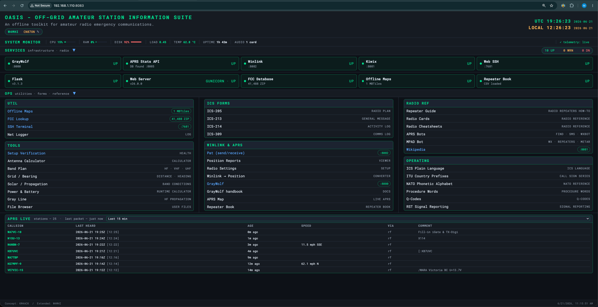
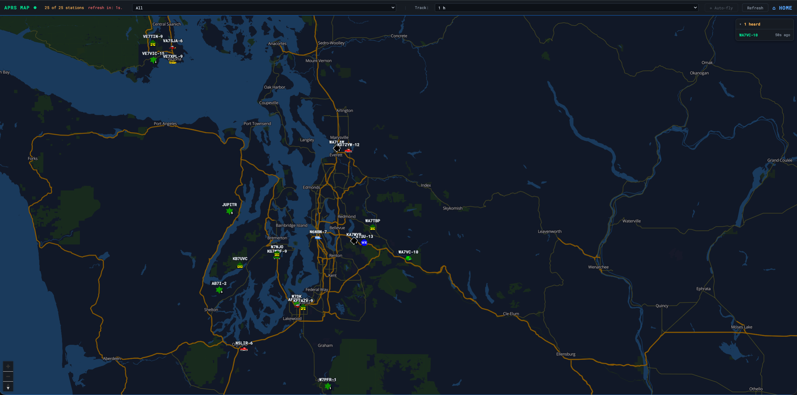
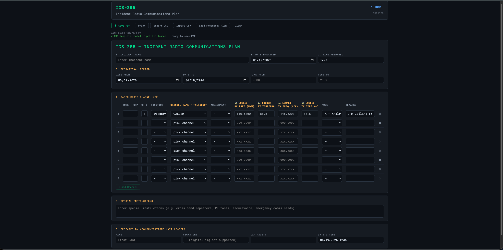
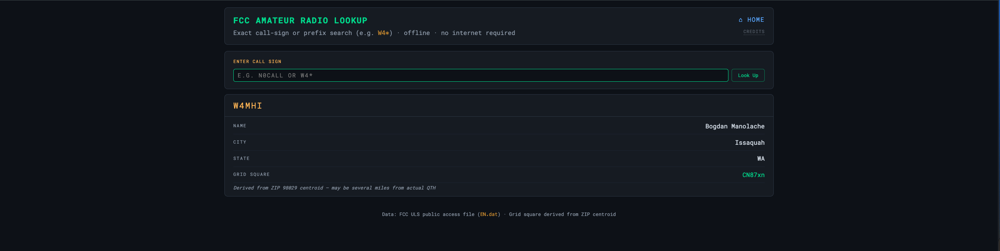
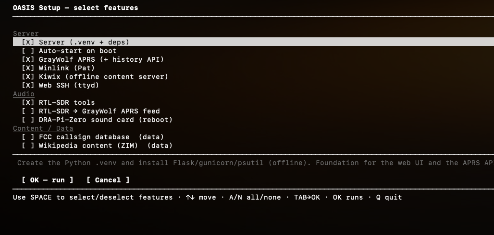

<div align="center">

# 🛜 OASIS

### Off-grid Amateur Station Information Suite

> ### *Comms when the network's gone dark.*

**A complete amateur-radio EmComm toolkit that runs with zero internet — on a Raspberry Pi, your laptop, or a USB stick.**

Forms · FCC lookup · offline maps · APRS · calculators · reference library — served to any browser on your local network.


</div>

<div align="center">
  
  <br><br>
  
  
  
</div>

---

## ⚡ At a glance

| | |
|---|---|
| **What it is** | A browser dashboard for emergency communications, served from a tiny local web server. |
| **Who it's for** | Hams running nets, ARES/RACES ops, field deployments, and grid-down preparedness. |
| **The promise** | No internet at runtime. No cloud account. No app to install on client devices. |
| **Runs on** | Raspberry Pi 3/4/5 (primary) · also macOS, Windows, Linux. |
| **Access it** | Any phone/tablet/laptop on the same Wi-Fi or hotspot → `http://<host-ip>:8083`. |

📖 **Want the *why*?** Read **[concept.md](concept.md)** — the vision, the problem it solves, and the design principles.

---

## ✨ Features

- **📋 Emergency forms** — ICS **205 · 213 · 214 · 309** on official FEMA PDF templates. Import/export CSV, auto-save, import frequencies from CHIRP.
- **🔎 FCC callsign lookup** — sub-millisecond binary search over a local copy of the FCC amateur database. Search by **callsign** (exact or prefix wildcard), **name** (last name + optional first name), or **Maidenhead grid** (2–6 char prefix). Returns callsign, name, city, state, grid, lat/lon. No database engine; three sorted flat-file indexes.
- **🗺️ Offline maps** — OpenStreetMap vector tiles via MapLibre GL + PMTiles, streamed from the host with HTTP range reads. Multi-region, switchable layers, not a single tile from the internet. Load maps at runtime straight off a USB stick or the GrayWolf tiles directory — no copying into the repo.
- **📻 Repeater Book** — load a CHIRP-format CSV from RepeaterBook, browse with instant search/filters, and export the visible set as a ready-to-import frequency plan.
- **📡 APRS** *(Pi)* — **GrayWolf** TNC / iGate / digipeater with a live station map (track history, auto-fly, sonar animations), APRS Stats API, and tactical messaging. Dashboard shows live station table with callsign, last-heard time, speed, altitude, and comment.
- **📧 Winlink** *(Pi)* — Pat client + web UI for store-and-forward email over radio.
- **🛰️ GPS / GNSS** *(Pi)* — live GPS card in the dashboard header: fix mode (3D/2D/no-fix), satellites, HDOP (colour-coded by quality), altitude, lat/lon, and chrony clock-lock status.
- **🌐 OpenWebRX** *(Pi)* — optional SDR receiver web UI for spectrum monitoring.
- **🧮 Tools & calculators** — antenna, grid/distance/bearing, power & battery budget, gray-line propagation, band conditions, and a net check-in logger with CSV export.
- **📚 Reference library** — U.S. band plan, Q-codes, phonetics, procedure words (including ICS plain-language substitution table), RST, ITU prefixes, per-radio cheat-sheets, CHIRP guides, GrayWolf handbook. Drop your own PDFs into `radio-manuals/`.
- **📖 Offline Wikipedia** *(Pi)* — Kiwix serving a ZIM snapshot.
- **⚙️ System monitor** — live CPU%, RAM, disk, load, temperature, uptime, audio devices, network SSID/clients, and Pi power-throttle status — all colour-coded and updated every 30 s.
- **🔧 Service controls** — start/stop controllable services (GrayWolf, Winlink, Kiwix, Web SSH, OpenWebRX) directly from the dashboard service strip without SSH.
- **📐 Units toggle** — switch all measured values (temperature, altitude, speed) between imperial and metric from a single pill button; preference persisted per browser.
- **💾 Portable USB bundle** — package the whole suite into a self-contained folder that runs with no system Python on Windows (`--for-windows`), or Pi/Linux only (default).

---

## 🚀 Quick start

### Raspberry Pi / Linux — the guided way *(recommended)*

```bash
git clone https://github.com/W4MHI/oasis-emcomm
cd oasis-emcomm

python3 setup-oasis.py     # guided menu — NOT with sudo
./start.sh
```

<div align="center">
  
</div>

`setup-oasis.py` is a checkbox menu: tick the features you want (server, APRS, Winlink, Kiwix, Web SSH, FCC data, …) and it runs the right install scripts **in order**, pulling in prerequisites and asking for your password just once. The server is pre-checked — that alone gives you the dashboard, FCC lookup, and maps. Tick **Auto-start on boot** to skip `./start.sh` entirely. Re-run the menu anytime to add features.

### macOS / Windows — the manual way

The guided installer is Pi/Linux-only (it drives `apt`/`systemd`). On a laptop, run the two underlying scripts:

```bash
git clone https://github.com/W4MHI/oasis-emcomm
cd oasis-emcomm

python3 scripts/setup-server.py                    # install server (offline)
python3 scripts/setup-fcc-database.py --full-zip   # optional: FCC data (~160 MB, online)

./start.sh                                          # Windows: double-click start.bat
```

Then open **`http://localhost:8083`** — or `http://<host-ip>:8083` from any other device on the network.

> 💡 **Truly offline install.** The server needs no internet — Flask, gunicorn, and psutil ship as pre-built wheels for every supported platform and Python 3.9–3.14. Only the one-time data downloads (FCC, maps, Wikipedia) go online, and you can do them on any machine and copy the result to the Pi.

---

## 🧩 How it works

A single small **Flask** app serves the dashboard, the FCC lookup API, and the map tiles. Everything heavy (forms, calculators, reference) is static HTML running in the browser via `localStorage` — the server never holds browser state. Companion services run as their own processes and the dashboard discovers them at runtime, so a missing service just greys out a card.

| Port | Service |
|:--:|---|
| **8083** | OASIS — dashboard, FCC lookup, map tile server |
| 8085 | APRS history API (feeds the dashboard map) |
| 8080 | GrayWolf APRS *(optional, Pi)* |
| 8082 | Pat Winlink web UI *(optional, Pi)* |
| 8081 | Kiwix offline Wikipedia *(optional, Pi)* |
| 7681 | webssh / ttyd browser terminal *(optional, Pi)* |

**Design principles:** offline at runtime · no CDN links (all JS/CSS/fonts local) · minimal backend · `localStorage` only · zero client install. More in **[concept.md](concept.md)**.

---

## 🧰 Setup scripts

On a Pi, **`setup-oasis.py` is the front door** — it delegates to the individual scripts below, so each stays the single source of truth. The only hard requirement underneath is `setup-server.py`; everything else is opt-in, per feature.

> 🔢 **Version-aware, suite-aware & idempotent:** every `install-*` script installs when absent, **upgrades** when newer, and **keeps what you have** otherwise — never downgrades. It also picks the **newest source** (apt vs the bundle) and the packages for **your OS version** (bookworm/trixie), so a bundle built for an older OS can't install a stale, broken driver on a newer one. Re-running setup, or installing from an older USB bundle, can't clobber a newer package. [Details](docs/offline-architecture.md).

> 📦 **Why the repo stays small:** the large data (map tiles, FCC database, PDF manuals, Wikipedia) is downloaded or generated by these scripts, not stored in the repo. A fresh clone is just code.

<details>
<summary><b>Full script reference</b> — what to run, when & why</summary>

<br>

| Script | What it does | When | Runs on | Internet? |
|---|---|---|---|:--:|
| **`setup-oasis.py`** | Guided menu installer — pick features, delegates to the install/enable scripts in order; primes `sudo` once | Set up a Pi; re-run to add features | Raspberry Pi / Linux (as your user, **not** sudo) | ⚠️ bundled if present |
| **`setup-server.py`** | Creates `.venv` and installs Flask / gunicorn / psutil | Once after cloning; again if `requirements.txt` changes | Every host that runs OASIS | ❌ offline |
| `setup-fcc-database.py` | Downloads FCC license data and builds the callsign index | Once before first use; weekly for fresh data (FCC updates Sundays) | Any online machine, then copy to the Pi | ✅ yes |
| `install-graywolf.py` | Installs **GrayWolf** APRS (TNC/iGate/digipeater) + history API on :8085 | On the Pi, to turn on APRS | Raspberry Pi / Debian | ⚠️ bundled `.deb` if present |
| `install-winlink.py` | Installs **Pat** Winlink client + web UI (:8082), writes a starter config | On the Pi, for Winlink email | Raspberry Pi / Debian | ⚠️ bundled `.deb` if present |
| `install-kiwix.py` | Installs `kiwix-serve` offline-content server | On the Pi, for offline Wikipedia | Raspberry Pi / Linux | ⚠️ bundled if present |
| `install-rtl-sdr.py` | Installs RTL-SDR tools (+ socat/tcpdump + multimon-ng), blacklists the DVB driver | On the Pi, for USB SDR dongles | Pi OS **Trixie** (V4 needs librtlsdr ≥ 2.0) | ⚠️ bundled `.deb` if present |
| `enable-rtl-sdr.py` | Tests the dongle, streams demodulated APRS audio into GrayWolf | After `install-rtl-sdr.py`, dongle plugged in | Pi OS **Trixie** | ❌ offline |
| `enable-dra-pi.py` | Configures the DRA-Pi-Zero (WM8731) sound card for GrayWolf — **reboot required** | On a Pi with the DRA-Pi-Zero HAT | Raspberry Pi | ❌ offline |
| `install-webssh.py` | Installs **ttyd** browser SSH terminal on :7681 | On the Pi, for a web shell | Raspberry Pi / Debian | ⚠️ bundled binary if present, else downloads |
| `enable-autostart-pi.py` | Installs a **systemd service** so OASIS starts on boot; `--with-browser` adds a Chromium kiosk; `--desktop-icon` adds a clickable desktop shortcut; `--disable` removes all | After first successful manual run | Raspberry Pi OS (systemd) | ❌ offline |
| `download-wikipedia.py` | Downloads a Wikipedia ZIM snapshot for Kiwix | After `install-kiwix.py` | Pi (or prep + copy) | ✅ yes |
| `create-oasis-offline.py` | Incrementally updates offline packages, then builds the USB bundle. `--rebuild` for a clean slate | Anytime; produces `oasis-offline/` | Any online host | ⚠️ Windows runtime only |

</details>

### 💾 Portable USB bundle

```bash
python3 scripts/create-oasis-offline.py
```

Updates all offline packages (wheels · GrayWolf · Kiwix · RTL-SDR · webssh · FCC database), then produces a self-contained folder that runs with no system Python on Windows and bootstraps from vendored wheels on Linux/macOS. Use `--skip-windows` for a 100% offline Linux/macOS build.

---

## 📻 Repeater Book

Browse repeater listings offline at `repeaterbook/repeaterbook.html`. There's no bundled data — RepeaterBook listings are **not redistributable**, so you download your own.

1. At **[repeaterbook.com](https://www.repeaterbook.com)**, sign in (free) and search your region.
2. Export → **CHIRP** format.
3. Save as **`repeaterbook/repeaterbook.csv`** (next to `index.html`).

> ⚠️ **Do not redistribute the CSV** — no public repos, shared USB bundles, or any other form. It's gitignored for this reason.

<details>
<summary>Viewer features</summary>

<br>

| Feature | Details |
|---|---|
| **Search** | Filter by name, frequency, callsign, city, or comment text — live as you type |
| **Mode filter** | FM · DMR · YSF/C4FM · P25 · D-STAR · NXDN · M17 |
| **Status filter** | Open / Closed |
| **Sortable columns** | Click any header to sort |
| **EMCOMM badge** | Auto-flags repeaters mentioning ARES, RACES, SKYWARN, etc. |
| **Export to Frequency Plan** | Saves the visible repeaters as CHIRP CSV to `chirp/<datetime>_repeaters.csv` — ready for ICS-205 or CHIRP |
| **Print** | Browser print dialog for a paper copy |
| **Service card** | Dashboard shows green when CSV is present, red when missing |

</details>

---

## 📡 APRS on the Raspberry Pi

APRS is the flagship Pi capability. OASIS installs and supervises **[GrayWolf](https://github.com/chrissnell/graywolf)** — a browser-based APRS TNC, iGate, and digipeater — and adds a companion API so the dashboard shows live stations on the offline map.

```bash
python3 scripts/install-graywolf.py     # picks the right .deb for your arch
```


GrayWolf runs on port **8080**; OASIS reads its history database and plots station positions on the dashboard map. Full configuration (audio, PTT, beacons, SmartBeaconing, digipeater rules, iGate) is in **[docs/SETUP.md](docs/SETUP.md)**.

> ⚠️ **Restart GrayWolf after you create the device + channel** in its web UI:
> ```bash
> sudo systemctl restart graywolf
> ```
> GrayWolf reads channel config only when the modem **starts** — a device/channel you add at runtime isn't live until a restart, and it can keep reporting `state=RUNNING` on the old config while nothing decodes. (The classic *"I set it up, nothing worked, I restarted and it just worked."*)

### 📻 RTL-SDR receive — **Raspberry Pi OS Trixie only**

To feed APRS into GrayWolf from an **RTL-SDR dongle** (receive / iGate), OASIS demodulates 2 m APRS and streams the audio into GrayWolf over `sdr_udp`:

```bash
python3 scripts/install-rtl-sdr.py      # RTL-SDR driver + tools
python3 scripts/enable-rtl-sdr.py       # test the dongle, wire it into GrayWolf
```

> ⚠️ **Requires Raspberry Pi OS Trixie (Debian 13) or newer.** The RTL-SDR Blog **V4** needs **`librtlsdr` ≥ 2.0**, and only Trixie ships it (`2.0.2`). **Bookworm and Bullseye top out at `librtlsdr 0.6.0`** — the V4 won't lock or decode there, and `apt` can't upgrade it. Use Trixie (or build the rtl-sdr-blog driver from source). Setup, gotchas, and the full debugging guide: **[docs/graywolf-rtl-sdr.md](docs/graywolf-rtl-sdr.md)**.

<details>
<summary>Live map features (<code>/aprs/map.html</code>)</summary>

<br>

Refreshes every 15 seconds and includes:

- **Station markers** — APRS symbol icons with callsign labels; click for last-heard time, speed, course, altitude, and path.
- **Historical track** — **⟳ Show track** draws a station's position history; the time window (1 h → all) is selectable and re-fetches each cycle.
- **✈ Auto-fly** — flies to the tracked station's latest position on each refresh.
- **Recent-heard panel** — newly heard/updated stations, newest-first; click a callsign to fly there. New markers get an amber sonar-ping animation that settles into a dim halo.
- **Focus via URL** — clicking a callsign in the dashboard table opens the map at `?focus=CALLSIGN` and loads its track.

</details>

---

## 🔐 Security

OASIS is built for a **trusted off-grid LAN or hotspot**. It binds to `0.0.0.0` (so other devices can reach it) and has **no authentication** — anyone on the same network can use it. That's right for a field net, but:

> ⚠️ **Don't expose OASIS to the public internet or an untrusted network.** Keep it on your own hotspot/LAN, or behind a firewall/VPN for remote access.

---

## 💻 Platform support & hardware

Reference build: **Raspberry Pi 3/4/5**, 32 GB SD card, Raspberry Pi OS Lite 64-bit, on a local hotspot/LAN — no internet. Also runs on any Linux/macOS/Windows host.

<details>
<summary>Offline-install matrix (verified with <code>create-oasis-offline.py --check</code>)</summary>

<br>

| Platform | Python 3.9 | 3.10 | 3.11 | 3.12 | 3.13 | 3.14 |
|---|:--:|:--:|:--:|:--:|:--:|:--:|
| **Raspberry Pi (64-bit / aarch64)** | ✅ | ✅ | ✅ | ✅ | ✅ | ✅ |
| Linux x86-64 | ✅ | ✅ | ✅ | ✅ | ✅ | ✅ |
| macOS (Apple Silicon) | ✅ | ✅ | ✅ | ✅ | ✅ | ✅ |
| macOS (Intel) | ✅ | ✅ | ✅ | — | — | — |
| Windows (amd64) | ✅ | ✅ | ✅ | ✅ | ✅ | ✅ |

The server and everything else run on Raspberry Pi OS **Bookworm** (3.11) and **Bullseye** (3.9) too. 32-bit Pi OS (armv7l/armhf) is not yet covered offline.

**Exception — RTL-SDR APRS requires Raspberry Pi OS Trixie (Debian 13):** the RTL-SDR Blog V4 needs `librtlsdr ≥ 2.0`, which only Trixie ships. Bookworm/Bullseye top out at `0.6.0` and can't drive the V4. (APRS via the DRA-Pi-Zero sound card has no such requirement.)

</details>

---

## 📖 Documentation

- **[concept.md](concept.md)** — what OASIS is, the vision, and design principles. *Start here for the why.*
- **[docs/SETUP.md](docs/SETUP.md)** — full setup, data pipelines, and deployment: server + systemd auto-start · FCC database · building map PMTiles from OSM · GrayWolf APRS · Kiwix/Wikipedia · ICS PDF templates · USB bundle · keeping data fresh.
- **[docs/offline-architecture.md](docs/offline-architecture.md)** — how the offline install resolves packages: the suite-aware manifest, builder vs installer, capability gates (why the install is OS-version-aware).

> 🛠️ **Maintainers:** keep offline packages current with `scripts/create-oasis-offline.py` (incremental — only downloads what changed; `--rebuild` for a full refresh). CI (`server-setup`) verifies `setup-server.py` across all platforms and Python versions on every push.

---

## 🙏 Credits

**OASIS** is designed and maintained by **W4MHI** (Pacific Northwest) for field deployment in Washington state.

It grew out of the **ACK Off-Grid Ham Radio Server** by **Jason, KM4ACK** (Tennessee) — the original concept of a fully offline, browser-accessible amateur-radio toolkit on a Raspberry Pi is his. [KM4ACK on GitHub](https://github.com/km4ack) · APRS by **[GrayWolf](https://github.com/chrissnell/graywolf)** (Chris Snell) · offline Wikipedia by **[Kiwix](https://kiwix.org/)**.

<div align="center">

**73 — comms when the network's gone dark.**

</div>
