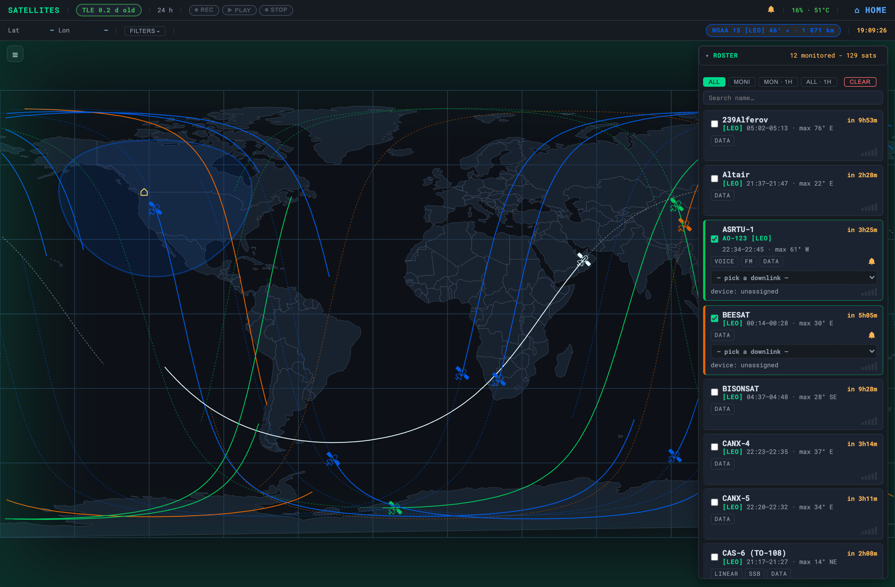
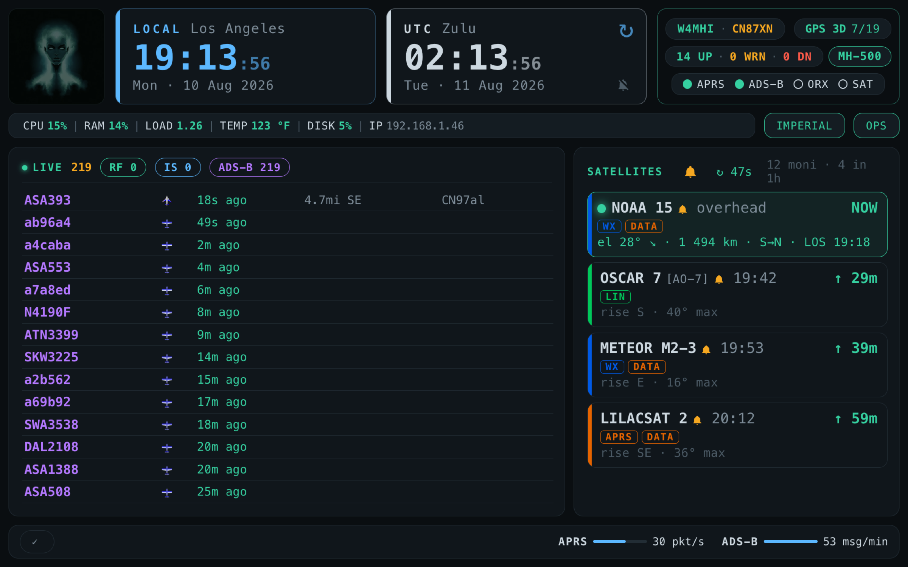

<div align="center">

# 🛜 OASIS

### Off-grid Amateur Station Integrated Suite

> ### *A complete amateur-radio station that just works — with or without the internet.*
>
> *Comms when the network's gone dark.*

**A complete, offline amateur-radio station you actually enjoy using — on a Raspberry Pi, your laptop, or a USB stick. Ready when the grid goes down.**

Forms · FCC lookup · offline maps · APRS · calculators · reference library — served to any browser on your local network.


[](https://github.com/W4MHI/oasis/actions/workflows/offline-install.yml)
[](https://github.com/W4MHI/oasis/actions/workflows/offline-manifest.yml)
[](https://github.com/W4MHI/oasis/actions/workflows/js-tests.yml)

</div>

<div align="center">
  
  <br><br>
  
  
  
</div>

---

## ⚡ At a glance

| | |
|---|---|
| **What it is** | A complete offline amateur-radio station in a browser dashboard, served from a tiny local web server. |
| **Who it's for** | Hams at the bench, in the field (POTA/SOTA), running nets — and ARES/RACES ops when the grid is down. |
| **The promise** | No internet at runtime. No cloud account. No app to install on client devices. |
| **Runs on** | Raspberry Pi 3/4/5 (primary) · also macOS, Windows, Linux. |
| **Access it** | Any phone/tablet/laptop on the same Wi-Fi or hotspot → `http://<host-ip>:8083`. |

📖 **Want the *why*?** Read **[concept.md](docs/concept.md)** — the vision, the problem it solves, and the design principles.

---

## ✨ Features

Each feature links to its full setup section, and the grouping **mirrors the dashboard** (`index.html`) so the README and the live station read the same. New here? Start with **[Quick start](#-quick-start)** — the server alone gives you the dashboard, FCC lookup, maps, forms, calculators, and the reference library.

### 📊 Dashboard header — system monitor

- **⚙️ System monitor** — a header row of live cards: **local + UTC clocks**, a **GPS card**, a **CPU card** (usage, SoC temp, RAM, disk, plus per-core usage bars), and a **PROCESSES card** (top 3 by CPU, 1-min load average). Host, LAN IP, and Pi power/throttle state sit as pills in the brand block; uptime rides on the OPS section header. Colour-coded green/amber/red by threshold; deeper checks live on the [Diagnostics](docs/SETUP.md#health-check-doctor) page. → [Setup](docs/SETUP.md#server-setup)
- **🛰️ GPS / GNSS & time sync** *(Pi)* — GPS-disciplined clock (`gpsd` + `chrony`) for accurate FT8/WSPR/SSTV timing with no internet, plus a live GPS card in the header: fix mode (3D/2D/no-fix), satellites, HDOP (colour-coded), altitude, lat/lon, and chrony clock-lock status. → [Setup](docs/SETUP.md#gps-time-sync-gpsd--chrony)
- **📶 Wi-Fi manager** — the pill tells you how the Pi reaches the network at a glance (`OASIS` in blue when hosting the AP fallback, the connected SSID coloured green/amber/red by signal, dim when disconnected) — and tapping it opens a picker that **scans, joins, forgets, and raises the AP**, so a field laptop can move the station onto a new network without SSH. Shared between dashboard and touch kiosk. → [Setup](docs/SETUP.md#using-oasis-in-the-field-no-internet)
- **📇 Station identity** — set your callsign and Maidenhead grid once from the header pill. It seeds satellite pass prediction (including your minimum-elevation floor), grid/bearing, the APRS object names, and the ICS forms. → [Setup](docs/SETUP.md#server-setup)
- **🔔 Hour bell** — the UTC clock strikes the top of the hour, in three states from one control: **off**, **chime** (the strike alone), or **voice** (the strike, then the spoken time). Quiet hours 22:00–07:00 local, and arming during quiet hours means tonight only. → [Setup](docs/SETUP.md#oasis-dashboard--kiosk-display)
- **📐 Units toggle** — switch all measured values (temperature, altitude, speed) between imperial and metric from one pill; preference persisted per browser. Satellite readouts stay metric by design. → [Setup](docs/SETUP.md#tools--calculators)
- **🌓 Light / dark theme** — one toggle in the top bar, applied before first paint so there's no flash, and injected by the server into every OASIS page so the whole suite switches together. → [Setup](docs/SETUP.md#server-setup)

### 📡 Traffic — the live map

- **✈️ APRS + ADS-B live map** *(Pi)* — the central panel plots **GrayWolf APRS stations** and **`dump1090-fa` aircraft** together on one offline map: altitude-coloured icons, airline decode from the flight callsign, track history, auto-fly, sonar animations, a 24 h history drawer, and emergency-squawk (7500/7600/7700) + station-proximity alerts. Fed by the radio services below. → [ADS-B](docs/SETUP.md#ads-b-aircraft) · [APRS](docs/SETUP.md#graywolf-aprs)
- **⚠️ Warnings & hazards** *(Pi)* — drop an incident marker on the map from a catalog of **15 EmComm types** (EOC, shelter, fire, flood, hazmat, road closed, water point, medical, power outage, …), each carrying its correct APRS symbol. Markers sync to every screen on the station, and where a TX path exists they can be **broadcast as APRS objects** — choosing IS, RF, or both per warning — then cleanly killed with a tombstone when the incident clears. Every glyph is inline SVG, so it renders on a Pi with no emoji font. → [Setup](docs/SETUP.md#graywolf-aprs)
- **🗺️ Offline maps** — OpenStreetMap vector tiles via MapLibre GL + PMTiles, streamed from the host with HTTP range reads: multi-region, switchable layers, not a single tile from the internet. Tiles come from **GrayWolf's** store (`/var/lib/graywolf/tiles/state`), where you download them per state under a registered callsign — OASIS reads that inventory rather than shipping or fetching tiles of its own. → [Setup](docs/SETUP.md#offline-maps)

### 🛰 Services — infrastructure · radio

The daemon-backed cards in the dashboard **SERVICES** strip. Once **[service controls](docs/SETUP.md#service-controls-dashboard-power-buttons)** are enabled you start/stop each straight from the strip — no SSH.

- **🌐 Web server** — Flask + gunicorn serving the dashboard, FCC lookup, map tiles, forms, and the API. The foundation everything else rides on. → [Setup](docs/SETUP.md#server-setup)
- **📡 APRS** *(Pi)* — **GrayWolf** TNC / iGate / digipeater with a live station map (track history, auto-fly, sonar) and tactical messaging, plus the **APRS Stats API** that feeds the dashboard and map. → [Setup](docs/SETUP.md#graywolf-aprs)
- **📻 APRS SDR feed** *(Pi, Trixie)* — demodulate 2 m APRS from a USB RTL-SDR dongle and feed it into GrayWolf (receive / iGate). → [Setup](docs/SETUP.md#rtl-sdr)
- **✈️ ADS-B aircraft** *(Pi)* — decode 1090 MHz aircraft locally with `dump1090-fa`; positions plot on the Traffic map above. Shares the RTL-SDR dongle, so starting it stops the APRS feed / OpenWebRX. → [Setup](docs/SETUP.md#ads-b-aircraft)
- **📧 Winlink RF** *(Pi)* — Pat client + web UI for store-and-forward email over radio. **Internet gateway (Telnet) works now; the RF radio path is experimental** — see [Winlink setup](docs/SETUP.md#winlink-pat) for status. → [Setup](docs/SETUP.md#winlink-pat)
- **🌐 OpenWebRX** *(Pi)* — optional SDR receiver web UI for spectrum monitoring and multi-mode decoding. → [Setup](docs/SETUP.md#openwebrx-sigint)
- **📚 Wiki Kiwix** *(Pi)* — Kiwix serving an offline Wikipedia ZIM snapshot. → [Setup](docs/SETUP.md#kiwix--wikipedia)
- **💻 Web SSH** *(Pi)* — a browser login shell (ttyd) on the Pi — no SSH client needed. → [Setup](docs/SETUP.md#webssh--browser-terminal)
- **🗣️ Speech** *(Pi)* — a station-wide voice any subsystem can call. The server synthesises a WAV with **Piper** (neural voice **Jenny**, en_GB) in a subprocess and caches it by content under a 50 MB budget; the browser plays it through the same unlocked AudioContext as the pass chime, so announcements queue instead of mushing together. Opt-in, and Python 3.11+ / 64-bit only — without it every announcement still speaks, using the espeak-ng fallback. Neither engine nor voice model lives in the repo; the bundle build fetches both. → [Setup](docs/SETUP.md#speech-piper-voice)
- **🎛️ HW / SRV matrix** — the **Service Operations console** (the "mixer board"): a device→service assignment matrix to reroute an SDR or sound-card between APRS, ADS-B, satellites, and Winlink with one tap, per-device **lock** to protect an assignment, and a one-click **STOP ALL**. A **resource guardian** thread — on by default, tunable or disablable — watches temperature/CPU/memory and, on a threshold trip (80 °C / 95 % / 92 % by default, tunable), arms a 30 s cancellable STOP ALL — always leaving **Web SSH** running so it can't lock you out. → [API](docs/api.md#hardware-allocation-apihardware)

### 🧭 Ops — utilities · forms · reference

The dashboard **OPS** grid, in the same sub-groups:

- **🛠 SYSOP** — **OASIS Setup** (a browser installer, not just a health check — it installs and removes features) · **OASIS Diagnostic** (22 checks in 5 groups, rolled up into capability verdicts like *APRS RX* and *Winlink*, with a single "fix this first" pick) · **Net Logger** (net check-in log with callsign/name/location/traffic and CSV export). → [Setup](docs/SETUP.md#server-setup)
- **🗺 Monitor** — **Traffic Map** (the live map above) · **🛰️ Satellites World Map** *(Pi)*: an offline pass predictor for the ham and weather birds — a roster from **SatNOGS** (downlink freqs + modes) and **CelesTrak** (TLEs), next-pass times, peak elevation *and the azimuth it peaks at*, slant range to a bird overhead, and a live sky/footprint view via **Skyfield/SGP4**, all computed on the Pi and baked into the offline bundle at build time. Birds are named the way operators say them (**AO-7**, not "OSCAR 7"), with orbit class on the designator line. **Monitored·1h / All·1h** views, a **Filters** menu (capability · band · orbit class LEO/MEO/GEO/HEO), a **minimum-elevation floor you set** rather than one hardcoded at 10°, Morse-"V" + spoken pass alerts at T-10/T-5 that **the touch kiosk sounds too** (monitoring a bird arms its bell; bells live in the shared roster, so arming one on a laptop wakes the shack, while muting stays per-screen), and **live SDR audio** — pick a downlink from the dropdown, then Listen or Record through the pass (FM/APRS · CW · SSB, resolved by frequency *and* mode). The card offers only what your station can actually tune, and nothing is armable until an SDR is assigned to it. → [Setup](docs/SETUP.md#satellites)
- **📋 ICS Forms** — ICS **205 · 213 · 214 · 309** on official FEMA AcroForm PDF templates. Import/export CSV, import frequencies from CHIRP, auto-save to localStorage — plus a **server-side save and restore**, so a cleared cache or a swapped tablet doesn't take the operational record with it. → [Setup](docs/SETUP.md#ics-forms)
- **🔎 Lookup** — **FCC callsign lookup** (sub-millisecond binary search over a local copy of the FCC amateur DB by **callsign** exact/prefix, **name**, or **Maidenhead grid**) · **Repeater Book** · **Band Plan** · **Radio Cards** · **ITU country prefixes**. → [FCC](docs/SETUP.md#fcc-callsign-lookup) · [Repeater Book](docs/SETUP.md#repeater-book)
- **📚 Library** — **Radio Manuals** (drop your own PDFs into `static/radio-manuals/`) · **GrayWolf Handbook** · **OASIS Handbook** · **Repeater Guide** · **Wikipedia** · **Winlink Radio Settings**. → [Setup](docs/SETUP.md#reference-library)
- **🧮 Tools** — **Antenna Calculator** · **Power & Battery Budget** · **Solar / Propagation** · **Gray Line** · **Grid / Bearing** · **File Browser**. → [Setup](docs/SETUP.md#tools--calculators)
- **📖 Operating Reference** — NATO phonetics, Q-codes, procedure words (with the ICS plain-language substitution table), and RST signal reporting. → [Setup](docs/SETUP.md#reference-library)

### 🔩 Deployment & hardware add-ons

Field-deployment and on-device extras (not dashboard cards):

- **📶 Wi-Fi AP fallback** *(Pi)* — the Pi hosts the `OASIS` hotspot automatically when no known network is in range, so other devices connect with no router. → [Setup](docs/SETUP.md#using-oasis-in-the-field-no-internet)
- **🖐 Touch kiosk** *(Pi)* — a second, touch-first dashboard for a panel mounted in the go-box, in **800×480** or **1920×1200**: dual clock faces with the hour bell, live traffic and satellite cards (look angles, range, per-bird mute, a "last looked" stamp), area-hazard and emergency chips, SDR flow meters, a system stat bar, and the same Wi-Fi pill, health pill, and HW/SRV console as the desktop dashboard — all driven from one shared service registry, so the two screens can't disagree about what's running. → [Setup](docs/SETUP.md#oasis-dashboard--kiosk-display)
- **👤 Station avatar** *(Pi)* — on the 1920×1200 kiosk, a face that wakes and glows in its own colour whenever the station speaks, with the mouth animation gated on the audio actually starting rather than on the request being sent. Tap for a greeting. Needs the Speech service; without it the card stays out of the way. → [Setup](docs/SETUP.md#oasis-dashboard--kiosk-display)
- **🕐 Hardware RTC** *(Pi)* — optional battery-backed clock that keeps time across reboots and total power loss: Witty Pi 3 (DS3231) or the BigTreeTech 7″ panel's onboard PCF8563. → [Setup](docs/SETUP.md#hardware-rtc-witty-pi-3--bigtreetech-7)
- **📻 DRAWS HAT** *(Pi)* — two-port radio audio and GPS/PPS from the NW Digital DRAWS HAT, brought up on Trixie with a self-compiled `draws.dtbo` so the HAT and `librtlsdr ≥ 2.0` can coexist on one box. The two radio ports become assignable devices in the HW/SRV console. → [Setup](docs/SETUP.md#gps-time-sync-gpsd--chrony)
- **🖥️ Panel & cooling** *(Pi)* — on-device CM4Stack panel display, [RGB Cooling HAT](docs/SETUP.md#rgb-cooling-hat) fan/OLED, and [Argon ONE fan control](docs/SETUP.md#argon-one-case-fan-control) — the last of which masks `argononed`, because upstream watches GPIO4, the same pin an L76X GPS HAT uses for 1PPS, which produced phantom shutdowns. → [Setup](docs/SETUP.md#cm4stack-panel-display)
- **💾 Portable USB bundle** — package the whole suite into a self-contained folder that runs with no system Python on Windows (`--for-windows`), or Pi/Linux only (default). → [Setup](docs/SETUP.md#usb--portable-bundle)

---

## 🚀 Quick start

OASIS is **offline-first**, so the recommended path is to build a self-contained bundle **on your everyday computer** (macOS / Windows / Linux) and carry it to the Raspberry Pi on a USB stick. The Pi never needs internet.

### 1 · Clone on your computer

```bash
git clone https://github.com/W4MHI/oasis
cd oasis
```

### 2 · Build the offline USB bundle

```bash
python3 scripts/create-oasis-offline.py        # add --for-windows to also bundle the Windows runtime
```

This downloads every offline asset (Python wheels · GrayWolf · Kiwix · RTL-SDR · webssh · Pat · FCC database · map tools) and assembles a self-contained **`oasis-offline/`** folder in the repo root. Copy that whole folder onto a USB drive.

### 3 · Keep the bundle current

Re-run the same command anytime — it's **incremental**, so it only fetches what changed. To refresh an existing copy in place (for example the one already on your USB), use `--update`:

```bash
python3 scripts/create-oasis-offline.py --update                 # update ./oasis-offline in the oasis folder
python3 scripts/create-oasis-offline.py --update --dir /mnt/usb  # or update the USB drive directly
```

### 4 · Copy the bundle to the Raspberry Pi

Plug the USB into the Pi and copy the bundle into your home directory (e.g. `~/oasis`).

> 🚫 **Don't `git clone` directly on the Pi for a full deployment.** A clone gives you code only — you'd still need internet on the Pi to pull GrayWolf, Kiwix, the FCC database, and the rest. And once the offline assets are generated, the working folder grows large (wheels, `.deb`s, tiles, ZIMs). Build the bundle on your computer and carry it over. *(A bare clone on the Pi is fine only if you want just the server + dashboard and nothing that needs downloads.)*

> ⚠️ **Fresh Pi?** Flash the SD card, enable SSH, and install `git` first — see **[Before you begin](docs/SETUP.md#before-you-begin-raspberry-pi)**. `git` isn't pre-installed on Raspberry Pi OS Lite.

### 5 · Run the guided setup

On the Pi, run the menu **as your normal user — not with sudo**:

```bash
cd ~/oasis
python3 setup-oasis.py          # guided checkbox menu
```

**Reboot when it finishes** so all settings and services come up cleanly:

```bash
sudo reboot
```

After the Pi is back online:

- If you ticked **Auto-start on boot**, OASIS is already running — just open `http://<pi-ip>:8083`.
- Otherwise, start it manually, then open `http://<pi-ip>:8083`:

  ```bash
  cd ~/oasis
  scripts/start-server.sh
  ```

> 💡 **Truly offline.** Flask, gunicorn, and psutil ship as pre-built wheels for every supported platform and Python 3.9–3.14. Only the one-time data downloads (FCC, maps, Wikipedia) touch the internet — do them on any machine and carry the result over.

---

## 🧭 The setup menu — what to tick

On a Pi, **`setup-oasis.py` is the front door for a terminal install** — it delegates to the individual scripts below, so each stays the single source of truth. The only hard requirement underneath is `setup-server.py`; everything else is opt-in, per feature.

> 🖥️ **There is a second front door.** Once the server is up, the **OASIS Setup** page in the dashboard installs and removes features from the browser — no SSH. It needs `scripts/enable-oasis-installer.py` to have been run once, which installs the root worker that performs privileged installs. The two menus overlap but are not identical; a handful of hardware features are currently reachable from only one of them. → [Setup](docs/SETUP.md#guided-setup-menu)

> 🔢 **Version-aware, suite-aware & idempotent:** every `install-*` script installs when absent, **upgrades** when newer, and **keeps what you have** otherwise — never downgrades. It also picks the **newest source** (apt vs the bundle) and the packages for **your OS version** (bookworm/trixie), so a bundle built for an older OS can't install a stale, broken driver on a newer one. Re-running setup, or installing from an older USB bundle, can't clobber a newer package.

> 📦 **Why the repo stays small:** the large data (map tiles, FCC database, PDF manuals, Wikipedia) is downloaded or generated by these scripts, not stored in the repo. A fresh clone is just code.

<details>
<summary><b>Full script reference</b> — what to run, when & why</summary>
`setup-oasis.py` is a grouped checkbox menu. Tick what you want; it runs the matching install/enable scripts **in order**, pulls in prerequisites, and asks for your password just once. The **pre-checked** items give you a working field station out of the box — dashboard, APRS, web terminal, service controls, and Wi-Fi fallback. Everything else is opt-in. Re-run the menu anytime to add features.

**Server**

| Menu item | Default | What it gives you |
|---|:--:|---|
| Server (.venv + deps) | ✅ | The Flask web server — dashboard, FCC lookup, map tiles. Foundation for everything. |
| Auto-start on boot | ✅ | systemd unit so OASIS starts at boot (skip the launcher). |
| GrayWolf APRS (+ history API) | ✅ | APRS TNC/iGate/digipeater on :8080 + history API on :8085. |
| Winlink (Pat) | ⬜ | Pat Winlink client + web UI on :8082 (Telnet works now; RF experimental). |
| Winlink RF via DigiRig | ⬜ | Point the Winlink Direwolf modem at a DigiRig Mobile (USB audio + CP210x serial RTS PTT) instead of the DRA-Pi. |
| Kiwix (offline content) | ⬜ | `kiwix-serve` on :8081 for ZIM content (add Wikipedia below). |
| Web SSH (ttyd) | ✅ | Browser terminal on :7681. |
| OpenWebRX (SDR monitor) | ⬜ | RX-only SDR web UI on :8073 — experimental, off by default. |
| Dashboard service controls | ✅ | Scoped sudoers rule so the dashboard start/stop buttons work. |
| Wi-Fi AP fallback | ✅ | Pi hosts the `OASIS` hotspot when no known network is in range. |

**Display** *(Raspberry Pi OS with Desktop)*

| Menu item | Default | What it gives you |
|---|:--:|---|
| Kiosk mode (Chromium fullscreen) | ⬜ | Auto-start + fullscreen Chromium kiosk of the desktop dashboard. |
| Kiosk mode — OASIS Dashboard, 7″ (800×480) | ⬜ | Fullscreen kiosk of the touch-first OASIS Dashboard on a 7″ panel. Sounds satellite pass alerts on the Pi itself. |
| Kiosk mode — OASIS Dashboard, 10″ wide (1920×1200) | ⬜ | The same OASIS Dashboard kiosk, tuned for a 10″ 1920×1200 panel. |
| Spoken announcements (Piper voice) | ⬜ | The **Jenny** neural voice for pass alerts, the hour bell, and the kiosk avatar. Python 3.11+, 64-bit only; falls back to espeak-ng without it. |
| CM4Stack panel (ST7789 + touch) | ⬜ | The on-device M5Stack CM4Stack panel display. |
| Desktop launcher icon | ⬜ | Clickable OASIS desktop shortcut. |

**Audio** *(audio paths into GrayWolf)*

| Menu item | Default | What it gives you |
|---|:--:|---|
| RTL-SDR tools | ⬜ | `rtl_test`/`rtl_fm` + socat/tcpdump; blacklists the DVB driver. **Pi OS Trixie for the V4.** |
| RTL-SDR → GrayWolf APRS feed | ⬜ | Streams demodulated 2 m APRS into GrayWolf over `sdr_udp`. |
| ADS-B Aircraft | ⬜ | 1090 MHz aircraft on the offline map (`dump1090-fa` + recorder on :8086); shares the SDR dongle. Off by default. |
| DRA-Pi-Zero sound card | ⬜ | Configures the WM8731 codec for GrayWolf — **reboot required**. |
| DRA-Pi green RX LED | ⬜ | Pulses the RX LED on decoded packets. |

**GPS / Time · RTC**

| Menu item | Default | What it gives you |
|---|:--:|---|
| GPS time (gpsd + chrony) | ⬜ | GPS-disciplined clock for FT8/WSPR/SSTV timing with no internet. |
| Witty Pi 3 RTC (DS3231) | ⬜ | Battery-backed hardware clock — **reboot required**. |
| BigTreeTech 7″ RTC (PCF8563) | ⬜ | The 7″ touchscreen's onboard clock (DSI `i2c_csi_dsi` bus) — **reboot required**. |

**Content / Data** *(large downloads / dashboard toggles)*

| Menu item | Default | What it gives you |
|---|:--:|---|
| FCC callsign database | ✅ | Downloads + indexes the FCC amateur DB (~160 MB). |
| Satellite list (SatNOGS + CelesTrak) | ✅ | Builds the satellite roster + TLEs so offline pass prediction works (~5 MB). Refresh every few days. |
| Satellite pass-alert voice | ✅ | The **fallback** voice (speech-dispatcher + espeak-ng, ~5 MB apt) used when Piper isn't installed; alerts still chime without either. |
| Wikipedia content (ZIM) | ⬜ | Downloads a Wikipedia ZIM for Kiwix (1 GB → ~100 GB). |
| Repeater Book listing | ✅ | Shows the dashboard link — drop your own `repeaterbook.csv` in. |
| ICS Forms section | ✅ | Toggles the ICS-205/213/214/309 dashboard section. |

✅ = pre-checked · ⬜ = opt-in

---

## 🧩 How it works

A single small **Flask** app serves the dashboard, the FCC lookup API, and the map tiles. Everything heavy (forms, calculators, reference) is static HTML running in the browser via `localStorage` — the server never holds browser state. Companion services run as their own processes and the dashboard discovers them at runtime, so a missing service just greys out a card.

| Port | Service |
|:--:|---|
| **8083** | OASIS — dashboard, FCC lookup, map tile server, ICS/tools, **Satellites** page + pass API + live SDR audio |
| 8085 | APRS history API (feeds the dashboard map) |
| 8086 | ADS-B recorder + history API *(optional, Pi)* |
| 8080 | GrayWolf APRS *(optional, Pi)* |
| 8082 | Pat Winlink web UI *(optional, Pi)* |
| 8081 | Kiwix offline Wikipedia *(optional, Pi)* |
| 8073 | OpenWebRX+ SDR receiver *(optional, Pi — off by default)* |
| 7681 | webssh / ttyd browser terminal *(optional, Pi)* |
| 8000 | Direwolf AGWPE, the RF modem behind Winlink *(optional, Pi)* |

**Design principles:** offline at runtime · no CDN links (all JS/CSS/fonts local) · minimal backend · `localStorage` only · zero client install. More in **[concept.md](docs/concept.md)**.

---

## 🧰 Setup scripts

| Script | What it does | When | Runs on | Internet? |
|---|---|---|---|:--:|
| **`setup-oasis.py`** | Guided menu installer — pick features, delegates to the install/enable scripts in order; primes `sudo` once | Set up a Pi; re-run to add features | Raspberry Pi / Linux (as your user, **not** sudo) | ⚠️ bundled if present |
| **`setup-server.py`** | Creates `.venv` and installs Flask / gunicorn / psutil | Once after cloning; again if `requirements.txt` changes | Every host that runs OASIS | ❌ offline |
| `services/fcc_database/install.py` | Downloads FCC license data and builds the callsign index | Once before first use; weekly for fresh data (FCC updates Sundays) | Any online machine, then copy to the Pi | ✅ yes |
| `services/graywolf/install.py` | Installs **GrayWolf** APRS (TNC/iGate/digipeater); also calls `enable-graywolf-api.py` automatically | On the Pi, to turn on APRS | Raspberry Pi / Debian | ⚠️ bundled `.deb` if present |
| `services/graywolf/enable-graywolf-api.py` | Installs and enables the GrayWolf APRS history API service (port 8085); run manually to re-enable after moving the repo | After GrayWolf install | Raspberry Pi / Linux (systemd) | ❌ offline |
| `services/winlink/install.py` | Installs **Pat** Winlink client + web UI (:8082), writes a starter config, and sets up a Direwolf RF modem (`--modem-interface dra`\|`digirig`) | On the Pi, for Winlink email | Raspberry Pi / Debian | ⚠️ bundled `.deb` if present |
| `services/kiwix/install.py` | Installs `kiwix-serve` offline-content server | On the Pi, for offline Wikipedia | Raspberry Pi / Linux | ⚠️ bundled if present |
| `features/rtl-sdr/install-rtl-sdr.py` | Installs RTL-SDR tools (+ socat/tcpdump + multimon-ng), blacklists the DVB driver | On the Pi, for USB SDR dongles | Pi OS **Trixie** (V4 needs librtlsdr ≥ 2.0) | ⚠️ bundled `.deb` if present |
| `services/rtl-feed/install.py` | Tests the dongle, streams demodulated APRS audio into GrayWolf | After `features/rtl-sdr/install-rtl-sdr.py`, dongle plugged in | Pi OS **Trixie** | ❌ offline |
| `services/openwebrx/install.py` | Installs **OpenWebRX+** receive-only SDR web UI on :8073 (off by default) | On the Pi, for spectrum monitoring | Pi OS bookworm/trixie | ✅ yes (3rd-party repo) |
| `services/adsb/install.py` | Installs **`dump1090-fa`** (1090 MHz ADS-B decoder) + the OASIS recorder/history API on :8086 (off by default) | On the Pi, for aircraft tracking | Pi OS bookworm/trixie | ⚠️ bundled `.deb` if present, else online |
| `services/satellites/build-roster.py` | Aggregates the satellite list from **SatNOGS** (freqs/modes) + **CelesTrak** (TLEs) into `configuration/satellites.json` | On any online machine; re-run every few days as TLEs age | Any host | ✅ yes |
| `services/satellites/install-predict.py` | Installs the **Skyfield** + numpy pass-prediction stack into the server venv (required for passes/track) | When enabling Satellites | Any host running OASIS | ⚠️ bundled wheels if present, else online |
| `features/speech/install.py` | Installs **Piper** and the **Jenny (Dioco)** neural voice into the server venv — the primary voice for pass alerts, the hour bell, and the kiosk avatar. Self-declines on unsupported platforms | Optional; enables spoken announcements | Pi / Linux, Python 3.11+, 64-bit | ⚠️ bundled wheels + model if present |
| `services/satellites/install-voice.py` | Installs the **fallback** TTS stack (speech-dispatcher + espeak-ng), used when Piper isn't installed | Optional; superseded by the Piper voice above | Raspberry Pi / Debian | ⚠️ apt step online |
| `scripts/enable-oasis-installer.py` | Installs `oasis-installer.service`, the root worker that performs privileged installs **requested from the browser Setup page**. Without it the web installer can't install anything that needs root | Before using the browser Setup page to install features | Raspberry Pi / Linux (systemd) | ❌ offline |
| `features/argon-fan/install-argon-fan.py` | Fan-only control for the Argon ONE case; masks `argononed`, which watches GPIO4 and collides with the L76X GPS 1PPS line | On a Pi in an Argon ONE case | Raspberry Pi | ⚠️ apt deps |
| `features/gps-L76X/install-gps-l76x.py` | Sets up the Waveshare L76X GPS HAT (UART + GPIO 1PPS) | On a Pi with the L76X HAT | Raspberry Pi | ⚠️ apt step online |
| `features/draws-gps/install-draws-gps.py` · `features/draws-audio/install-draws-audio.py` | Bring up the NW Digital **DRAWS** HAT — GPS/PPS and the two-port radio audio interface, including the shared `direwolf-draws` TNC | On a Pi with the DRAWS HAT | Raspberry Pi (Trixie) | ⚠️ apt deps |
| `features/gps/install-gps.py` | Sets up GPS-disciplined time (`gpsd` + `chrony`) for offline FT8/WSPR/SSTV timing | On the Pi, with a USB GPS | Raspberry Pi / Debian | ⚠️ apt step online |
| `features/rtc-hat/enable-rtc.py` | Configures the Witty Pi 3 DS3231 RTC (GPIO `i2c-1`) — **reboot required** | On a Pi with the Witty Pi 3 | Raspberry Pi | ❌ offline |
| `features/rtc-raspad/enable-rtc.py` | Configures the BigTreeTech 7″ PCF8563 RTC (DSI `i2c_csi_dsi` bus) — **reboot required** | On a Pi with the 7″ panel | Raspberry Pi | ❌ offline |
| `features/dra-audio-interface/enable-dra-pi.py` | Configures the DRA-Pi-Zero (WM8731) sound card for GrayWolf — **reboot required** | On a Pi with the DRA-Pi-Zero HAT | Raspberry Pi | ❌ offline |
| `services/webssh/install.py` | Installs **ttyd** browser SSH terminal on :7681 | On the Pi, for a web shell | Raspberry Pi / Debian | ⚠️ bundled binary if present, else downloads |
| `enable-service-controls.py` | Grants a narrow sudoers rule so the dashboard can start/stop services | To enable dashboard power buttons | Raspberry Pi / Linux (systemd) | ❌ offline |
| `features/rgb-cooling-hat/install-rgb-cooling-hat.py` | Installs the Yahboom RGB Cooling HAT fan/OLED daemon | On a Pi with the HAT | Raspberry Pi | ⚠️ apt deps |
| `features/cm4stack/install-cm4stack.py` | Configures the M5Stack CM4Stack panel display — **reboot required** | On a CM4Stack | Raspberry Pi (CM4) | ❌ offline |
| `enable-autostart-pi.py` | Installs a **systemd service** so OASIS starts on boot; `--with-browser` adds a Chromium kiosk; `--desktop-icon` adds a clickable desktop shortcut; `--disable` removes all | After first successful manual run | Raspberry Pi OS (systemd) | ❌ offline |
| `services/kiwix/download-wikipedia.py` | Downloads a Wikipedia ZIM snapshot for Kiwix | After `services/kiwix/install.py` | Pi (or prep + copy) | ✅ yes |
| `create-oasis-offline.py` | Incrementally updates offline packages **and builds the satellite roster** (runs `build-roster` at build time, so a fresh Pi ships working pass prediction), then assembles the USB bundle. `--rebuild` for a clean slate | Anytime; produces `oasis-offline/` | Any online host | ✅ yes |
| `enable-ap-fallback.py` | Installs a Wi-Fi AP fallback so the Pi hosts the `OASIS` hotspot when no known network is in range — includes the `oasis-netwatch` watcher service and `oasis-netctl` helper | On the Pi, for field / no-router deployments | Raspberry Pi OS (NetworkManager) | ❌ offline |
| `features/dra-audio-interface/enable-dra-rx-led.py` | Installs a daemon that pulses the DRA-Pi-Zero green RX LED (GPIO 16) on each decoded APRS packet — GrayWolf drives TX/PTT, this covers RX | After the DRA-Pi install, reboot, and GrayWolf running | Raspberry Pi with DRA-Pi-Zero HAT | ❌ offline |
| `doctor.py` | Headless health check — runs the same 22-check sweep as the browser Diagnostics page and rolls it into capability verdicts. **Exits 0 when no *critical* check failed, 1 when one or more did**, so `python3 scripts/doctor.py \|\| echo "not ready"` is a complete CI gate | Post-deploy or SSH verification | Any host running OASIS | ❌ offline |
| `remove-oasis.py` | Dry-run, check, or apply a full teardown: stops/disables all OASIS services, removes managed system files, strips OASIS blocks from `config.txt` — never deletes downloaded data | When uninstalling or resetting to a clean state | Raspberry Pi / Linux | ❌ offline |

</details>

### 💾 Portable USB bundle

Building and updating the bundle is covered in **[Quick start](#-quick-start)** (steps 2–3). In short: `create-oasis-offline.py` updates all offline packages (wheels · GrayWolf · Kiwix · RTL-SDR · webssh · Pat · FCC database · map tools · the Piper voice) and produces the self-contained `oasis-offline/` folder.

| Flag | What it does |
|---|---|
| *(none)* | Incremental build of the full Pi bundle into `oasis-offline/` — only fetches what changed |
| `--for-windows` | Also bundle the embedded Python runtime that `scripts/start-server.bat` needs |
| `--profile windows` | Build a **separate tools-only** bundle in `oasis-offline-windows/` — Flask, standalone tools, and FCC lookup, with no Pi hardware, APRS/Winlink, ZIMs or maps |
| `--all-platforms` | Also vendor the macOS + Windows pmtiles binaries (~166 MB); Linux only by default |
| `--update [--dir DIR]` | Refresh an existing bundle in place, including one already on a USB stick |
| `--verify [--dir DIR]` | Check every file in a bundle against `bundle-manifest.json`; exits 1 on any missing or corrupt file |
| `--check` | CI mode — report on offline assets, change nothing |
| `--rebuild` | Wipe and rebuild from scratch |

**Running the bundle on Linux.** `run-portable.sh` (and `scripts/start-server.sh`) build a Python virtualenv from the bundled wheels on first run. Two host requirements catch people out:

- **`python3` *and* its venv module.** Debian/Ubuntu/Raspberry Pi OS ship `python3` **without** the venv builder — install it once with `sudo apt install python3-venv` (Fedora/Arch already include it). Without it the first run fails and leaves a broken `_runtime/linux/.venv`.
- **A native Linux filesystem (ext4/btrfs/xfs).** A virtualenv needs symlinks, which **FAT32 / exFAT / NTFS USB sticks don't support** (`operation not permitted: …/.venv/lib64`). Copy the `oasis-offline/` folder onto the machine's disk — e.g. `cp -r oasis-offline ~/oasis-offline` — and run it from there rather than straight off the stick.

> 🔧 If a first run failed and left a stub venv, delete it before retrying: `rm -rf oasis-offline/_runtime/linux/.venv` (prefix `sudo` if the stub is root-owned), then re-run **as your normal user** (not `sudo`).

---

## 📻 Repeater Book

Browse repeater listings offline at `static/repeaterbook/repeaterbook.html`. There's no bundled data — RepeaterBook listings are **not redistributable**, so you download your own.

1. At **[repeaterbook.com](https://www.repeaterbook.com)**, sign in (free) and search your region.
2. Export → **CHIRP** format.
3. Save as **`static/repeaterbook/repeaterbook.csv`** (next to `repeaterbook.html`).

> ⚠️ **Do not redistribute the CSV** — no public repos, shared USB bundles, or any other form. It's gitignored for this reason.

<details>
<summary>Viewer features</summary>

<br>

| Feature | Details |
|---|---|
| **Search** | Filter by name, frequency, callsign, city, or comment text — live as you type |
| **Mode filter** | FM · DMR · YSF/C4FM · P25 · D-STAR · NXDN · M17 |
| **Status filter** | Open / Closed |
| **Sortable columns** | Click any header to sort |
| **EMCOMM badge** | Auto-flags repeaters mentioning ARES, RACES, SKYWARN, etc. |
| **Export to Frequency Plan** | Saves the visible repeaters as CHIRP CSV to `chirp/<datetime>_repeaters.csv` — ready for ICS-205 or CHIRP |
| **Print** | Browser print dialog for a paper copy |
| **Service card** | Dashboard shows green when CSV is present, red when missing |

</details>

---

## 📡 APRS on the Raspberry Pi

APRS is the flagship Pi capability. OASIS installs and supervises **[GrayWolf](https://github.com/chrissnell/graywolf)** — a browser-based APRS TNC, iGate, and digipeater — plus a companion history API so the dashboard plots live stations on the offline map. Both are **pre-checked** in the setup menu.


GrayWolf runs its own web UI on port **8080**; OASIS reads its history database and shows the stations on the dashboard and at `/server/map/map.html`.

### Feeding APRS from an RTL-SDR dongle

To receive 2 m APRS from an **RTL-SDR dongle**, tick **RTL-SDR tools** and **RTL-SDR → GrayWolf APRS feed** in the setup menu (or run the scripts directly):

```bash
python3 features/rtl-sdr/install-rtl-sdr.py      # RTL-SDR driver + tools
python3 services/rtl-feed/install.py       # test the dongle, start the audio feed
```

This demodulates APRS and streams the audio to **`127.0.0.1:7355`** over UDP. GrayWolf isn't wired to it yet — finish in the **GrayWolf web UI** (`:8080`):

1. **Station** — set your **callsign** to enable the station identity.
2. **Position log** — **enable the database** so heard stations are recorded. This is the table the dashboard and APRS API read.
3. **Audio Devices → + Add Device** — create the SDR input *(don't click **Detect Devices** — it auto-adds a soundcard that hijacks the channel):*
   - **source type** `sdr_udp` · **path** `127.0.0.1:7355` · **sample rate** `48000` · **channels** Mono · **format** s16le · **direction** input
4. **Channels → add an AFSK / RX channel** — 1200 bps, 1200 / 2200 Hz, **RX input = the sdr_udp device** (not a soundcard).
5. **Restart GrayWolf** so it loads the new device + channel:
   ```bash
   sudo systemctl restart graywolf
   ```

> ⚠️ **The restart matters.** GrayWolf reads channel config only when the modem **starts** — a device/channel you add at runtime isn't live until a restart, and it can keep reporting `state=RUNNING` on the old config while nothing decodes. *(The classic "I set it up, nothing worked, I restarted, and it just worked.")*

Once it's running, the **APRS LIVE** table on the dashboard fills in and keeps updating, and three service cards go **green**: **APRS GrayWolf**, **APRS Stats API**, and **APRS SDR Feed**. If the feed card shows **SILENT**, audio is reaching the feed but nothing is decoding — check the dongle/antenna and frequency. Full walkthrough and debugging: **[docs/graywolf-rtl-sdr.md](docs/graywolf-rtl-sdr.md)**.

> ⚠️ **RTL-SDR needs Raspberry Pi OS Trixie (Debian 13).** The RTL-SDR Blog **V4** needs **`librtlsdr` ≥ 2.0**, which only Trixie ships (`2.0.2`). Bookworm/Bullseye top out at `0.6.0` and can't drive the V4. *(APRS via the DRA-Pi-Zero sound card has no such requirement.)*

<details>
<summary>Live map features (<code>/server/map/map.html</code>)</summary>

<br>

Refreshes every 15 seconds and includes:

- **Station markers** — APRS symbol icons with callsign labels; click for last-heard time, speed, course, altitude, and path.
- **Historical track** — **⟳ Show track** draws a station's position history; the time window (1 h → all) is selectable and re-fetches each cycle.
- **✈ Auto-fly** — flies to the tracked station's latest position on each refresh.
- **Recent-heard panel** — newly heard/updated stations, newest-first; click a callsign to fly there. New markers get an amber sonar-ping animation that settles into a dim halo.
- **Focus via URL** — clicking a callsign in the dashboard table opens the map at `?focus=CALLSIGN` and loads its track.

</details>

---

## 🔐 Security

OASIS is built for a **trusted off-grid LAN or hotspot**. It binds to `0.0.0.0` (so other devices can reach it) and has **no authentication** — anyone on the same network can use it. That's right for a field net, but:

> ⚠️ **Don't expose OASIS to the public internet or an untrusted network.** Keep it on your own hotspot/LAN, or behind a firewall/VPN for remote access.

---

## 💻 Platform support & hardware

**Minimum hardware: Raspberry Pi 3 (2 GB) or better.** Reference build: **Raspberry Pi 3/4/5**, 32 GB SD card, Raspberry Pi OS Lite 64-bit, on a local hotspot/LAN — no internet. Also runs on any Linux/macOS/Windows host.

<details>
<summary>Offline-install matrix (verified with <code>create-oasis-offline.py --check</code>)</summary>

<br>

| Platform | Python 3.9 | 3.10 | 3.11 | 3.12 | 3.13 | 3.14 |
|---|:--:|:--:|:--:|:--:|:--:|:--:|
| **Raspberry Pi (64-bit / aarch64)** | ✅ | ✅ | ✅ | ✅ | ✅ | ✅ |
| Linux x86-64 | ✅ | ✅ | ✅ | ✅ | ✅ | ✅ |
| macOS (Apple Silicon) | ✅ | ✅ | ✅ | ✅ | ✅ | ✅ |
| macOS (Intel) | ✅ | ✅ | ✅ | — | — | — |
| Windows (amd64) | ✅ | ✅ | ✅ | ✅ | ✅ | ✅ |

The server and everything else run on Raspberry Pi OS **Bookworm** (3.11) and **Bullseye** (3.9) too. 32-bit Pi OS (armv7l/armhf) is not yet covered offline.

**Exception — RTL-SDR APRS requires Raspberry Pi OS Trixie (Debian 13):** the RTL-SDR Blog V4 needs `librtlsdr ≥ 2.0`, which only Trixie ships. Bookworm/Bullseye top out at `0.6.0` and can't drive the V4. (APRS via the DRA-Pi-Zero sound card has no such requirement.)

</details>

---

## 📖 Documentation

- **[docs/concept.md](docs/concept.md)** — what OASIS is, the vision, and design principles. *Start here for the why.*
- **[docs/SETUP.md](docs/SETUP.md)** — full setup, data pipelines, and deployment for **every** feature: server + systemd auto-start · AP fallback · FCC database · map PMTiles · GrayWolf APRS · ADS-B aircraft · satellites · Winlink · RTL-SDR · OpenWebRX · GPS time sync & hardware RTC · web SSH · service controls · ICS forms · tools & calculators · reference library · Repeater Book · CM4Stack panel · RGB Cooling HAT · USB bundle · health check · keeping data fresh.
- **[docs/api.md](docs/api.md)** — the complete HTTP API reference, every route the server registers. **[docs/api-contract.md](docs/api-contract.md)** — the response-shape contract all routes conform to, including what `ok` does and doesn't mean.
- **[docs/graywolf-dra-pi.md](docs/graywolf-dra-pi.md)** · **[docs/graywolf-rtl-sdr.md](docs/graywolf-rtl-sdr.md)** · **[docs/rtc-witty-pi.md](docs/rtc-witty-pi.md)** — hardware deep-dives: the DRA-Pi-Zero sound card, RTL-SDR APRS receive, and the Witty Pi 3 / DS3231 hardware clock.
- **The OASIS Handbook** — the operator's guide, served by the station itself at **Library → OASIS Handbook**, or read the source in `static/oasis-handbook/`. Where SETUP.md tells you how to *install* a thing, the handbook tells you how to *use* it.

> 🛠️ **Maintainers:** keep offline packages current with `scripts/create-oasis-offline.py` (incremental — only downloads what changed; `--rebuild` for a full refresh). CI (`server-setup`) verifies `setup-server.py` across all platforms and Python versions on every push.

---

## 📄 License

OASIS is released under the **[MIT License](LICENSE)** © 2026 W4MHI — free to use, modify, and distribute.

> 📋 **Everything else keeps its own terms — and there's a lot of it.** Because OASIS is offline-first it *redistributes* rather than links, so the full inventory of every bundled library, font, daemon, and dataset, with its licence and what obligations attach, lives in **[THIRD-PARTY-NOTICES.md](THIRD-PARTY-NOTICES.md)**. Read it before you redistribute a USB bundle.

The headlines:

- **OpenStreetMap** map data is **ODbL** — the on-map credit is a licensing requirement, not decoration.
- **RepeaterBook** CSV exports are **not redistributable**; export your own.
- **SatNOGS** transmitter data is **CC BY-SA** and **CelesTrak** TLEs go stale within days — both are fetched at build time.
- The **Jenny** voice carries a custom attribution licence — *not* CC-BY — that requires any interface generating audio from it to credit it as **"Jenny"**, and where practical **"Jenny (Dioco)"**. OASIS ships neither the engine nor the model; your bundle build downloads them.
- Radio manuals are copyright their manufacturers and are never redistributed.
- Companion services (GrayWolf, Pat, Kiwix, ttyd, OpenWebRX, dump1090-fa, Direwolf, rtl-sdr) ship under their own upstream licences — **several are GPL**. That's aggregation, not derivation, since each runs as its own process; but if you hand someone a USB bundle containing those packages, the GPL source obligation travels with it.

> ⚠️ **`overlays/` ships compiled binaries under a different licence.** The DRAWS
> device-tree overlays (`draws.dtbo`, `udrc.dtbo`) are built from the Raspberry Pi
> Linux kernel sources and are **GPL-2.0, not MIT** — Pi OS ships versions that do
> not bring the HAT up on kernel 6.18.34, so OASIS vendors working ones to keep a
> from-scratch install offline. Provenance, the full rebuild recipe, and a written
> offer for the corresponding source are in **[`overlays/SOURCE.md`](overlays/SOURCE.md)**.
> Deleting those files falls back to whatever the OS provides.

---

## 🤖 How OASIS Is Built

OASIS is a two-person team: **W4MHI** (design calls, radio-domain judgment, the Pi that everything ships to) and **Claude** (Anthropic's Claude Code) as the day-to-day build partner.

- **Every change is human-reviewed before it ships.** Claude writes and edits code; W4MHI decides what ships, tests it against real hardware (GrayWolf, RTL-SDR dongles, DRA-Pi, satellite passes), and is the one who signs off. Nothing merges to `main` unverified.
- **Plan first, then build.** Non-trivial changes get a written plan and a confirm step before code moves — same discipline the [design principles](docs/concept.md#design-principles) apply to the product itself.
- **The same gates apply to every change, AI-authored or not.** `scripts/run-tests.sh` for the unit suite, a preflight pass (manifest validation, byte-compile, lint) mirroring CI, and `doctor.py` for a live health check — all before anything is called done.
- **Offline-first constrains the AI too.** No dependency, library, or pattern gets suggested if it assumes a network connection, a CDN, or a database engine — the [prime directive](docs/concept.md) governs Claude's suggestions exactly like a human contributor's.
- **Small scope, real hardware.** This isn't a multi-contributor project with bots triaging issues — it's one maintainer and one AI teammate iterating directly against a Raspberry Pi 3, a stack of SDR dongles, and an actual radio bench.

Commits carry a `Team: W4MHI/Claude` trailer when Claude did the drafting — a record of who built what, not a disclaimer.

---

## 🤝 Contributing

OASIS is a personal project by **W4MHI**, built directly on the work of **Jason, KM4ACK** (see [Acknowledgments](#-acknowledgments) below). Contributions are welcome — **read [CONTRIBUTING.md](CONTRIBUTING.md) first**, because this project is opinionated in ways that are easy to trip over.

The short version:

- **The offline-first prime directive is absolute.** No runtime internet, no CDN, no external API, no npm or build step, no database engine, and it must still fit a Raspberry Pi 3 with 2 GB of RAM. This is the most common reason a change can't be merged, however good the idea.
- **No emoji in anything the Pi renders** — Pi OS Lite ships no emoji font, so they become tofu boxes on the actual product. Markdown files like this one are fine.
- **Hardware reports are the most valuable thing you can contribute** and need no code. Tell us what worked, or didn't, on your radio, dongle, HAT, or Pi model — [there's a template for it](.github/ISSUE_TEMPLATE/hardware_report.yml).
- **Run the gates before you push:**
  ```bash
  scripts/run-tests.sh                      # Python suite (uses .venv; system Python has no Flask)
  node --test 'tests/js/**/*.test.js'       # JS tests + the front-end syntax/hygiene gate
  ruff check .                              # lint
  python3 tests/test_offline_manifest.py    # manifest self-tests
  ```
- **Security issues go to [SECURITY.md](SECURITY.md)**, not a public issue. Note that "no authentication on the LAN" is the documented design, not a vulnerability.

By participating you agree to the [Code of Conduct](CODE_OF_CONDUCT.md).

---

## 🙏 Acknowledgments

**OASIS** is designed and maintained by **W4MHI** (Pacific Northwest) for field deployment in Washington state.

It grew out of the **ACK Off-Grid Ham Radio Server** by **Jason, KM4ACK** (Tennessee) — the original concept of a fully offline, browser-accessible amateur-radio toolkit on a Raspberry Pi is his. [KM4ACK on GitHub](https://github.com/km4ack)

OASIS is mostly an assembly of other people's excellent work. The station would do almost nothing without:

**Radio & RF**
[GrayWolf](https://github.com/chrissnell/graywolf) (Chris Snell) — the APRS TNC/iGate/digipeater engine, and the source of the offline map tiles · [Pat](https://getpat.io) (LA5NTA) — the Winlink client · [Direwolf](https://github.com/wb2osz/direwolf) (WB2OSZ) — the AX.25 software modem · [rtl-sdr](https://gitea.osmocom.org/sdr/rtl-sdr) (Osmocom) — the dongle driver everything RF rides on · [dump1090-fa](https://github.com/flightaware/dump1090) (FlightAware) — ADS-B decode · [OpenWebRX+](https://www.openwebrx.de/) — the spectrum receiver · [multimon-ng](https://github.com/EliasOenal/multimon-ng) · [Hamlib](https://hamlib.github.io/) — rig control.

**Maps & position**
[OpenStreetMap](https://www.openstreetmap.org) contributors — the map itself (ODbL) · [MapLibre GL](https://maplibre.org) — the renderer · [Protomaps](https://protomaps.com) — PMTiles, which is what makes streaming a basemap off a Pi possible at all · [Natural Earth](https://www.naturalearthdata.com) · [GeoNames](https://www.geonames.org) (CC BY 4.0) · **Heikki Hannikainen, OH7LZB** — [aprs-symbols](https://github.com/hessu/aprs-symbols) (aprs.fi, CC BY 2.0).

**Satellites**
[SatNOGS](https://db.satnogs.org/) — the transmitter database (CC BY-SA) · [CelesTrak](https://celestrak.org/) (Dr T.S. Kelso) — TLEs · [Skyfield](https://rhodesmill.org/skyfield/) and [python-sgp4](https://github.com/brandon-rhodes/python-sgp4) (Brandon Rhodes) — the pass prediction · [satellite.js](https://github.com/shashwatak/satellite-js).

**Voice**
[Piper](https://github.com/OHF-voice/piper1-gpl) (Open Home Foundation) — the neural TTS engine · **Jenny (Dioco)** — [the voice](https://github.com/dioco-group/jenny-tts-dataset), packaged by [rhasspy/piper-voices](https://huggingface.co/rhasspy/piper-voices) · [espeak-ng](https://github.com/espeak-ng/espeak-ng) — the phonemiser and the fallback voice.

**Reference & infrastructure**
[Kiwix](https://kiwix.org/) — offline Wikipedia · [ttyd](https://github.com/tsl0922/ttyd) — the browser terminal · [Flask](https://flask.palletsprojects.com) and [gunicorn](https://gunicorn.org) — the server · [pdf-lib](https://github.com/Hopding/pdf-lib) — fills the FEMA ICS forms in the browser · **FEMA** — the ICS form templates · the **FCC** — the ULS amateur database · [Inconsolata](https://github.com/googlefonts/Inconsolata) and [Roboto Mono](https://github.com/googlefonts/robotomono).

**Concept**
ADS-B and 433 MHz feature ideas inspired by [intercept](https://github.com/smittix/intercept) (smittix).

Full licences and redistribution terms for all of the above are in **[THIRD-PARTY-NOTICES.md](THIRD-PARTY-NOTICES.md)**. If your work is here and the attribution is wrong, or missing, please open an issue — it'll be fixed.

<div align="center">

**73 — comms when the network's gone dark.**

</div>
